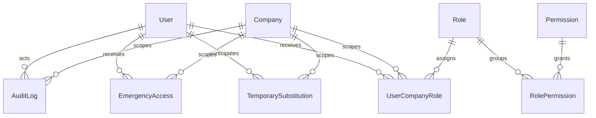

# Authorization Foundation — Data Model Proposal

**Status:** proposta sem migration

## 1. Diagnóstico do schema atual

| Estrutura                              | Reutilização                              | Lacuna                                                          |
| -------------------------------------- | ----------------------------------------- | --------------------------------------------------------------- |
| `User`, `RefreshToken`                 | identidade e sessão                       | política futura de refresh/logout não integra este recorte      |
| `Role`, `Permission`, `RolePermission` | catálogo global                           | governança/versionamento do catálogo                            |
| `UserCompanyRole`                      | assignment usuário–empresa–papel          | origem, concessor, revogação e unicidade temporal explícitas    |
| `UserRole`                             | administração global                      | restringir uso a `platform.*`                                   |
| `TemporarySubstitution`                | grant delegado vigente                    | catálogo relacional opcional e constraints de intervalo         |
| `EmergencyAccess`                      | grant emergencial vigente                 | mesmo limite de capabilities e evidência                        |
| `AuditLog`                             | auditoria indexada por empresa/ator/trace | classificação de leitura e resultado consultável, se necessário |
| `Company`                              | escopo empresarial                        | nenhuma mudança necessária para autoridade do contexto          |

## 2. Modelo alvo candidato

### Catálogo

- manter `roles`, `permissions` e `role_permissions`;
- adicionar futuramente a `permissions`: `scope` (`PLATFORM`/`COMPANY`), `riskClass`, `sensitiveData`,
  `createdAt`, `updatedAt` e eventual `retiredAt`;
- códigos são imutáveis; renomeação cria nova capability e migração controlada.

### Assignment empresarial

Evoluir `user_company_roles` com campos candidatos `grantedByUserId`, `grantReason`, `source`,
`revokedAt`, `revokedByUserId`, `revocationReason` e `version`. `validFrom`, `validTo` e `status` já
existem. A relação continua restritiva para `User`, `Company` e `Role`.

Constraints candidatas:

- `valid_to IS NULL OR valid_to > valid_from`;
- revogado exige `revoked_at`, revogador e motivo;
- ativo não pode ter revogação efetiva;
- role empresarial não pode conceder capability `PLATFORM`;
- índice parcial/constraint de exclusão impede assignment ativo duplicado no mesmo período.

### Grants temporários

As tabelas atuais são reutilizáveis. A lista `capabilities String[]` pode permanecer na primeira fase
com validação forte de catálogo; normalização futura para tabelas-filhas só deve ocorrer se consulta,
FK ou revogação por capability justificar migration. Constraints devem exigir atores distintos,
intervalo positivo, motivo e coerência entre status/revogação.

### Auditoria

`audit_logs` já possui ator, empresa, sessão, alvo, ação, trace, estados, motivo, IP, user-agent e
índices relevantes. Campos candidatos somente mediante consulta comprovada: `outcome`,
`sensitivityClass` e `policyVersion`. Valores sensíveis permanecem fora de metadata/estado.

## 3. Relacionamentos

## 4. Índices candidatos

- manter `UserCompanyRole(userId, companyId, status)` e `(companyId, roleId, status)`;
- adicionar índice por `(userId, companyId, validFrom, validTo)` para resolução temporal;
- adicionar índices parciais de grants ativos por empresa/beneficiário e expiração;
- manter `AuditLog(companyId, occurredAt)`, `(actorUserId, occurredAt)` e `traceId`;
- qualquer índice novo deve ser comprovado com plano de consulta PostgreSQL.

## 5. Sequência de migrations esperada

1. evolução aditiva do catálogo/assignment, se o Gate A confirmar os campos;
2. backfill técnico sem criar assignments ou grants;
3. constraints inicialmente validadas contra dados existentes;
4. índices concorrentes conforme política operacional;
5. somente depois, enforcement de aplicação por família.

Não haverá seed de `RolePermission`, `UserCompanyRole`, substituição ou emergência. O seed pode manter
o catálogo de códigos apenas se não conceder acesso e se a governança do catálogo for aprovada.

## 6. Impacto em testes

- migrations em PostgreSQL 16 limpo e com fixture de upgrade;
- vigência, expiração, revogação e sobreposição;
- duas empresas e role global sem autoridade de domínio;
- nenhuma concessão após seed;
- rollback transacional e integridade referencial;
- explain/análise das queries críticas de contexto.

## 7. Decisões antes de migration

O Gate A deve aprovar campos de provenance/revogação, normalização dos arrays, constraints temporais e
estratégia de catálogo. Até isso ocorrer, o schema atual permanece inalterado.

## 8. Matriz de aderência ao Prisma atual

| Conceito         | Situação                     | Alteração candidata                                         | Risco/compatibilidade      | Índice/constraint                       | Seed/testes                      |
| ---------------- | ---------------------------- | ----------------------------------------------------------- | -------------------------- | --------------------------------------- | -------------------------------- |
| usuário/sessão   | parcial                      | validar revogação por `sessionId`; sem tabela aprovada nova | médio; tokens atuais       | índice depende do modelo de sessão      | zero credencial; testes `401`    |
| capability       | existe (`Permission`)        | scope/risco/sensibilidade                                   | baixo, aditivo             | unique code já existe                   | catálogo sem concessão           |
| role–capability  | existe                       | validar escopo global/empresa                               | médio por dados existentes | PK composta existente                   | nenhum grant automático          |
| assignment       | parcial (`UserCompanyRole`)  | provenance e revogação                                      | médio; backfill técnico    | vigência e exclusão temporal            | fixtures ativo/expirado/revogado |
| grant temporário | existe                       | constraint de coerência/intervalo                           | médio em dados prévios     | beneficiário/status/expiração           | zero grant no seed               |
| emergência       | existe                       | constraint e taxonomia                                      | médio                      | índice atual + eventual parcial         | auto concessão negada            |
| segregação       | não persistida genericamente | policy/config versionada apenas quando caso exigir          | alto; decisão própria      | unicidade por versão                    | matriz de incompatibilidade      |
| auditoria        | existe                       | outcome/classificação somente se consulta justificar        | baixo/aditivo              | índices atuais suficientes inicialmente | rollback e sanitizer             |
| company scope    | existe nas relações          | tornar predicado obrigatório na aplicação                   | sem migration geral        | índices por família                     | duas empresas                    |
| global scope     | parcial (`UserRole`)         | restringir a `platform.*`                                   | médio por grants atuais    | sem índice novo inicial                 | testes global ≠ domínio          |

Nenhuma tabela nova está comprovadamente obrigatória para a ETP-015.1. Migration futura exige diff
aditivo, inventário de dados, backfill, validação PostgreSQL e rollback documentado.
