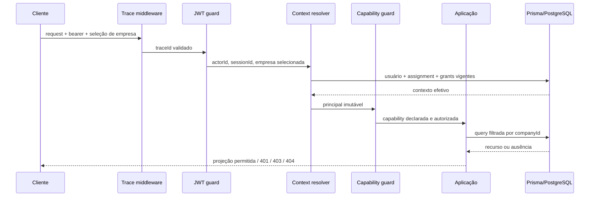

# Authorization Foundation — Technical Design

**Status:** proposta para revisão; sem implementação

## 1. Componentes reutilizáveis

O desenho estende, sem duplicar, `JwtStrategy`, `JwtAuthGuard`, `ApplicationContextService`,
`CapabilitiesGuard`, `AuthorizationService`, `AuditWriterService`, `UserCompanyRole`,
`TemporarySubstitution`, `EmergencyAccess`, o middleware de correlação e o filtro global de erros.

## 2. Pipeline canônico

## 3. Principal e empresa ativa

O principal canônico preserva `actorId`, `sessionId`, `activeCompanyId`, `permissions`, `traceId`, IP,
user-agent e grants usados. A empresa selecionada pode chegar pelo contrato de sessão existente, mas
só se torna ativa após validação de usuário, empresa, assignment, status e vigência. `companyId` de
DTO/path/query não substitui `activeCompanyId`.

Superfícies administrativas globais aceitam apenas capabilities `platform.*` classificadas. Casos de
uso de domínio sempre exigem empresa ativa, inclusive quando o ator possui papel global.

### 3.1 Autenticação e revogação

`JwtStrategy` valida assinatura e expiração; `ApplicationContextService` valida existência e status do
usuário. A ETP-015.1 deve decidir e testar como `sessionId` participa da revogação imediata: token com
sessão ausente, revogada ou expirada retorna `401`. Até essa verificação existir, o access token curto
continua sendo a fronteira observada e não deve ser descrito como revogação completa.

Identidade técnica/interna não reutiliza usuário humano silenciosamente. Job, fila ou integração
futura exige principal de serviço explícito, credencial rotacionável, company scope obrigatório para
domínio e capabilities próprias. Como não existe mecanismo aprovado, chamadas internas continuam
pelos mesmos casos de uso com contexto humano ou ficam bloqueadas.

Troca de empresa emite/resolve novo contexto, invalida caches empresariais do cliente e nunca conserva
capabilities da empresa anterior.

## 4. Modelo de autorização

- capabilities são códigos estáveis por recurso e leitura/escrita;
- ações críticas (`approve`, `close`, `reopen`, `export`, `sensitive.read`) são separadas;
- `Role` agrupa capabilities; autorização nunca compara `Role.code`;
- `UserCompanyRole` materializa assignment empresarial vigente;
- `UserRole` fica restrito à administração global explicitamente classificada;
- substituição e emergência acrescentam somente capabilities explícitas e vigentes;
- policy de segregação valida incompatibilidades por ação, ator e histórico;
- ausência de metadata, contexto, capability ou policy aplicável nega.

## 5. Decorators, guards e serviços

| Componente                  | Responsabilidade proposta                           |
| --------------------------- | --------------------------------------------------- |
| `@PublicSurface()`          | allowlist explícita; uso excepcional e inventariado |
| `@RequireCapabilities(...)` | capability mínima da operação                       |
| `@SensitiveRead(...)`       | projeção e evento de leitura sensível               |
| `JwtAuthGuard`              | identidade válida; `401`                            |
| resolvedor de empresa       | assignment/empresa vigente; sem consulta ampla      |
| `CapabilitiesGuard`         | deny-by-default e grants usados                     |
| `AuthorizationService`      | defesa no caso de uso e escopo empresarial          |
| policy de segregação        | incompatibilidades configuráveis e falha fechada    |
| projection/masking service  | seleção allowlist de campos                         |
| `AuditWriterService`        | escrita e auditoria na mesma transação              |

Guard global só poderá ser ativado quando todas as rotas estiverem classificadas. Até lá, a migração
é opt-in por família, e CI deve impedir nova rota sem classificação.

Capabilities passadas a `@RequireCapabilities(a, b)` possuem semântica **AND**, coerente com o guard
atual. Necessidade **OR** exige decorator/policy distinto e nomeado; não será inferida por array. A
ordem é trace → autenticação → contexto empresarial → capabilities → controller → autorização/policy
no caso de uso. Chamada interna não pode invocar repository como atalho: usa o caso de uso com contexto
explícito, que repete capability, empresa e policy.

## 6. Repositórios e isolamento

Portas de aplicação recebem `ApplicationActorContext`; adaptadores Prisma aplicam `companyId` no
`where` da primeira consulta. Detalhes usam chave composta lógica `{ id, companyId }`; listas não
aceitam empresa livre do cliente. Relações indiretas resolvem a empresa por join dentro da query ou
transação. Pós-filtragem e “buscar por ID, depois comparar” não são o padrão aceitável quando o filtro
pode ser expresso no banco.

Agregações, joins, updates e deletes incluem empresa no predicado e validam contagem/retorno dentro da
transação. Jobs, filas e tarefas assíncronas carregam `actor/servicePrincipal`, `companyId`,
capabilities delegadas, `traceId` e idempotency key; sem contexto completo falham fechados. Operação
global não percorre dados de domínio sem autorização empresarial explícita por empresa.

## 7. Semântica de erros

| Condição                                              | Resposta                                |
| ----------------------------------------------------- | --------------------------------------- |
| token ausente, inválido, expirado ou usuário inválido | `401`                                   |
| identidade/empresa válidas, capability ausente        | `403`                                   |
| recurso inexistente ou de outra empresa               | `404`                                   |
| estado, concorrência ou idempotência incompatível     | `409`                                   |
| validação estrutural                                  | `400`/`422` conforme contrato existente |

O filtro global mantém envelope e correlation ID. Auditoria interna pode distinguir negação sem
alterar a resposta externa.

## 8. Auditoria e masking

Escritas críticas usam `AuditWriterService.transaction`; estado, evento de domínio e `AuditLog`
compartilham o mesmo `TransactionClient`. Metadata é allowlist e nunca contém credenciais, headers,
body integral, documento ou dados bancários. Leituras sensíveis geram evento com finalidade/categoria,
ator, empresa, alvo e resultado, sem copiar o valor lido.

Projeções padrão retornam somente campos necessários. Uma capability adicional autoriza projeção
integral, ainda limitada à empresa ativa e à finalidade da rota. Masking ocorre no backend antes da
serialização; ocultação visual não é controle de segurança.

Cada família define classe de dados, campos padrão, campos integrais, capability sensível, finalidade,
cache e exportação. Erros nunca ecoam valores sensíveis. Relatórios e exports usam a mesma projeção e
auditoria da API; frontend limpa cache na troca de empresa.

Negações críticas (`403`, tentativa entre empresas e uso de grant inválido) geram evento de segurança
sanitizado fora da transação de domínio, sem revelar existência do recurso. Ausência de token pode ser
telemetria agregada; não cria `AuditLog` com ator fictício. A taxonomia e limites de volume pertencem à
ETP-015.7. Retenção permanece provisória, sem descarte automático antes da BDP-011.

## 9. Adapters e integração existente

Adapters legados preservam URI, status ou envelope durante a janela, mas convertem o comando e chamam
o mesmo caso de uso canônico. No fechamento, `/payroll-closures` deve delegar aos serviços canônicos de
readiness, close, reopen e history, preservando lock, idempotência, manifesto e auditoria. Não existe
fallback ao `PayrollClosuresService` como regra paralela.

Os módulos de payroll review e payroll periods são referências de integração. A ETP-015.4 introduziu
um guard global com compatibilidade nominal: 36 handlers canônicos possuem metadata e 129 handlers
legados conhecidos permanecem `LEGACY_DEFERRED`. O guard nega qualquer handler novo ausente das duas
fontes, sem converter o legado em protegido. Módulos restantes são migrados na ordem registrada no
backlog.

## 10. Segregação e grants

Policies recebem ator, empresa, capability, ação, recurso e evidência histórica. Grants são
explícitos, temporários, expirados/revogados imediatamente e auditados no uso. Acesso emergencial exige
capability de gestão, motivo e teto técnico. Nenhum grant copia papel, ignora empresa ou cria
assignment permanente.

## 11. Primitivas implementadas na ETP-015.4

`ROUTE_ACCESS_POLICY` é a única metadata de classificação. `@PublicRoute()`,
`@AuthenticatedRoute()`, `@RequireActiveCompany()` e `@RequireCapabilities()` compõem JWT, empresa
ativa e catálogo com semântica `ALL`. A allowlist pública usa identificadores nominais, o verificador
reconcilia discovery real do NestJS e OpenAPI expõe somente requisitos não sensíveis. Nenhum cache foi
adicionado; revogação e vigência são resolvidas por requisição.

## 12. Limites

Este desenho não atribui capabilities, não define cargos, não cria migration e não migra famílias de
negócio. Isolamento de queries, masking e auditoria de autorização permanecem nas ETP-015.5–015.7.
