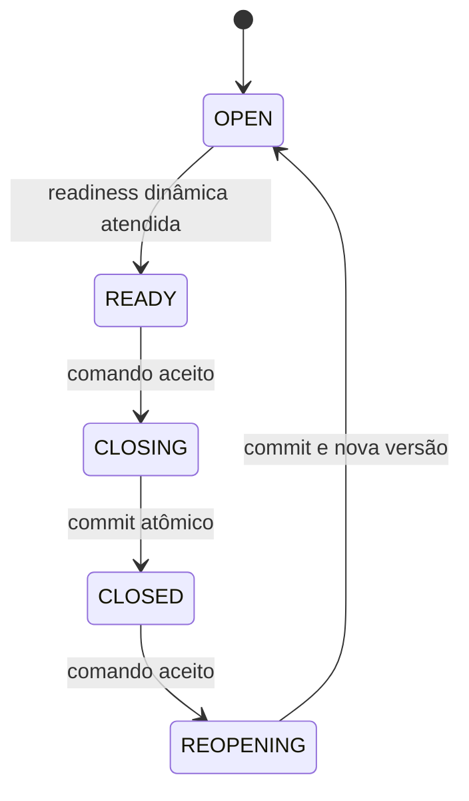

# Contrato canônico de fechamento de competência

**Status:** `APPROVED — VERSION 1` para orientar a implementação futura

**Decisão de negócio:** [BDP-014 v1](../project-management/BDP-014_RESOLUTION_V1.md)

**Implementação:** Fases 2 e 3 `COMPLETED`; Fase 4 `READY FOR REVIEW`

## 1. Agregado

`PayrollPeriod` é a raiz do agregado de fechamento operacional. `PayrollRun`, `PayrollReviewCycle`, decisões, achados e eventos são evidências referenciadas; `PayrollPeriodClosure` ou sua evolução representa a linha do tempo operacional append-only. `AuditLog` é trilha transversal, não substitui o evento de domínio nem o manifesto.

Toda mutação usa `payrollPeriodId` e deriva `companyId` do principal. IDs fornecidos são referências a validar, nunca autoridade empresarial.

## 2. Estados



- `OPEN` e `CLOSED` são estados persistidos necessários;
- `READY` é projeção dinâmica e não será persistido por padrão;
- `CLOSING` e `REOPENING` são candidatos; persistência depende da Fase 3 demonstrar necessidade para coordenação/recuperação;
- se a transação única tornar estados transitórios desnecessários, eles existirão apenas no modelo do comando/observabilidade;
- nenhum estado adicional está aprovado.

## 3. Invariantes

- somente uma versão operacional vigente por competência;
- fechamento usa exatamente uma execução explicitamente selecionada e canônica;
- execução pertence à competência/empresa, está `COMPLETED` e possui maior sequência válida;
- review pertence à mesma execução/empresa/competência, está `CLOSED` e na rodada vigente;
- decisões exigidas estão válidas e achados `BLOCKING` estão resolvidos;
- nenhum blocker obrigatório pode existir no instante do commit;
- warning obrigatório precisa de reconhecimento explícito;
- fechamento/reabertura, evento, manifesto e auditoria são atômicos;
- eventos e manifestos anteriores são append-only;
- reabertura não reabre review automaticamente e exige novo ciclo completo para reclose;
- competência `CLOSED` é imutável conforme a matriz da BDP-014.

## 4. Comandos candidatos

### Fechar

`POST /payroll-periods/:id/close`

Entrada candidata:

```text
Path: payrollPeriodId
Header: Authorization, Idempotency-Key, X-Correlation-Id
Body: payrollRunId, warningAcknowledgements[], reason?
```

O backend resolve o ciclo elegível; `reviewCycleId` informado pelo cliente, se adotado, será apenas confirmação e deverá coincidir com a evidência canônica.

### Reabrir

`POST /payroll-periods/:id/reopen`

Entrada candidata:

```text
Path: payrollPeriodId
Header: Authorization, Idempotency-Key, X-Correlation-Id
Body: reason
```

Motivo é obrigatório. O comando cria nova versão operacional e invalida somente o uso futuro da evidência, sem alterar o manifesto anterior.

## 5. Consultas candidatas

### Readiness

`GET /payroll-periods/:payrollPeriodId/closure-readiness?payrollRunId=:runId`

Implementado na Fase 2. Retorna estado atual, token observado, execução/ciclo candidatos, `isReady`, `blockers`, `warnings`, reconhecimentos futuros, trace e verificações indisponíveis. Não persiste avaliação; logs técnicos não são eventos de domínio.

### Histórico

`GET /payroll-periods/:id/closure-history`

Retorna versões operacionais, eventos, referências de manifesto, atores e motivos autorizados. Dados sensíveis são minimizados por capability e contrato.

### Resumo

`payroll.period.close.view` poderá proteger a leitura do estado/resumo usada pela tela. Readiness detalhada e histórico possuem capabilities próprias.

## 6. Blockers v1

Códigos candidatos estáveis:

- `PERIOD_ALREADY_CLOSED`;
- `CLOSURE_IN_PROGRESS`;
- `PAYROLL_RUN_NOT_FOUND`;
- `PAYROLL_RUN_NOT_COMPLETED`;
- `PAYROLL_RUN_NOT_CANONICAL`;
- `PAYROLL_RUN_CANCELLED_OR_INVALIDATED`;
- `PAYROLL_RUN_AMBIGUOUS`;
- `REVIEW_CYCLE_NOT_FOUND`;
- `REVIEW_CYCLE_RUN_MISMATCH`;
- `REVIEW_CYCLE_NOT_CLOSED`;
- `REVIEW_ROUND_OUTDATED`;
- `REVIEW_DECISIONS_INVALID`;
- `OPEN_BLOCKING_FINDINGS`;
- `COMPANY_PERIOD_RUN_REVIEW_MISMATCH`;
- `REQUIRED_TOTALS_UNAVAILABLE`;
- `CONCURRENT_OPERATION_DETECTED`.

Na Fase 2 os nomes foram estabilizados conforme a lista operacional de [readiness](../modules/PAYROLL_PERIOD_CLOSURE_READINESS.md), preservando a decisão material. Códigos sem fonte atual não são simulados.

## 7. Warnings v1

- `VARIABLE_PAY_PENDING`;
- `EXTERNAL_INTEGRATIONS_PENDING`;
- `NON_CRITICAL_OPERATIONAL_ALERTS`;
- `AUXILIARY_INFORMATION_INCOMPLETE`.

Cada warning informa código, mensagem, referências mínimas e `requiresAcknowledgement`. `VARIABLE_PAY_PENDING` sempre exige reconhecimento na v1. Warning não pode ser convertido em blocker sem nova decisão versionada.

## 8. Idempotência e concorrência

- `Idempotency-Key` obrigatória nos comandos, com formato UUID;
- escopo único: empresa + competência + operação + chave;
- hash canônico do payload detecta reutilização divergente;
- replay idêntico devolve representação persistida e indicação de replay;
- lock da linha da competência antecede a revalidação;
- versão otimista protege caminhos que não obtenham o lock;
- constraints impedem duas transições efetivas da mesma versão;
- `SELECT FOR UPDATE` ou advisory lock fica no adaptador Prisma/PostgreSQL;
- nenhum efeito é confirmado fora da transação de domínio/auditoria.

## 9. Evidência e manifesto

O manifesto é imutável, versionado e possui hash canônico com versão do algoritmo. Contém os campos mínimos homologados na BDP-014, incluindo IDs, versões, rodada, decisões, achados, totais, referência segura por colaborador, contexto do ator e warnings reconhecidos.

O hash detecta alteração e não substitui as fontes. Dados pessoais são referenciados ou resumidos no mínimo necessário. Retenção temporal pertence à BDP-011.

## 10. Eventos candidatos

A convenção usa substantivo do agregado, verbo no passado e `UPPER_SNAKE_CASE`, coerente com `REVIEW_CLOSED`/`REVIEW_REOPENED`:

- `PERIOD_READINESS_EVALUATED` — somente se avaliação vier a ser persistida por necessidade comprovada;
- `PERIOD_CLOSURE_STARTED` — somente se `CLOSING` for persistido;
- `PERIOD_CLOSED`;
- `PERIOD_REOPENING_STARTED` — somente se `REOPENING` for persistido;
- `PERIOD_REOPENED`;
- `CLOSURE_EVIDENCE_INVALIDATED`;
- `VARIABLE_PAY_WARNING_ACKNOWLEDGED`.

Eventos condicionais não serão criados apenas para reproduzir logs. `PERIOD_CLOSED`, `PERIOD_REOPENED` e invalidação da evidência são eventos de domínio obrigatórios nas respectivas transições; o reconhecimento pode integrar o manifesto e evento específico conforme o modelo homologado na Fase 3.

## 11. Capabilities

| Capability                       | Operação                      |
| -------------------------------- | ----------------------------- |
| `payroll.period.close.view`      | resumo do fechamento          |
| `payroll.period.close.readiness` | blockers/warnings detalhados  |
| `payroll.period.close.execute`   | fechamento                    |
| `payroll.period.close.reopen`    | reabertura                    |
| `payroll.period.close.history`   | histórico/evidência permitida |

São empresariais, deny-by-default, verificadas em controller e serviço, sem assignments automáticos e sem nomes de papéis. O frontend apenas reflete o contexto autorizado.

## 12. Erros

| Situação                                                 | HTTP aprovado/candidato                                     |
| -------------------------------------------------------- | ----------------------------------------------------------- |
| DTO/header inválido                                      | `400`                                                       |
| não autenticado                                          | `401`                                                       |
| capability ausente                                       | `403`                                                       |
| recurso fora da empresa ou inexistente                   | `404`                                                       |
| estado, versão, idempotência ou concorrência conflitante | `409`                                                       |
| readiness não atendida                                   | `422`, ou equivalente do padrão consolidado antes da Fase 2 |
| falha inesperada                                         | `500` com trace, sem detalhes sensíveis                     |

Blockers devem ser retornados de forma estruturada; mensagens humanas não serão o único contrato.

## 13. Relações

### `PayrollRun`

O comando referencia a execução explicitamente. O backend confirma empresa por `PayrollPeriod`, maior sequência válida, `COMPLETED`, totais e ausência de erro bloqueante.

### `PayrollReviewCycle`

O backend localiza e valida o ciclo `CLOSED` correspondente, rodada, submissão, decisões, invalidações, achados e `REVIEW_CLOSED`. Reabrir competência não muda esse ciclo.

### `AuditLog`

Registra ator, empresa, trace, sessão, IP, user-agent, motivo, estados anterior/posterior, entidade, ação e metadata sanitizada, usando o mesmo cliente transacional. O manifesto/evento continua sendo a evidência de domínio.

## 14. Compatibilidade legada

As rotas inventariadas em [PAYROLL_CLOSURE_LEGACY_INVENTORY.md](PAYROLL_CLOSURE_LEGACY_INVENTORY.md) serão adaptadores temporários. Elas delegarão ao mesmo orquestrador e não poderão relaxar capability, empresa, blocker, warning, idempotência, lock ou auditoria. Diferenças de envelope serão tratadas no adaptador enquanto durar a janela.

## 15. Limites da v1

- sem integração externa, notificação ou scheduler;
- sem alçada financeira ou tolerância monetária;
- sem descarte/retention schedule;
- sem movimentação automática de remuneração variável;
- sem reabertura automática do review;
- sem remoção do legado;
- sem estado adicional além dos cinco avaliados;
- sem regra legal ou cálculo novo.

As Fases 2 e 3 concretizam a consulta e sua fundação persistente interna. A Fase 4 implementa
`POST /payroll-periods/:id/close` com readiness transacional, advisory lock, idempotência, manifesto,
eventos e auditoria atômica. A migration 0015 adiciona `PayrollPeriodClosureVersion`, manifesto,
eventos, acknowledgements e idempotência, preservando a tabela legada
`payroll_period_closures`. O manifesto usa `sha256-canonical-json-v1`, e evidências são append-only
no PostgreSQL. Reabertura, histórico HTTP, adaptação das demais rotas legadas e frontend continuam
não implementados.
