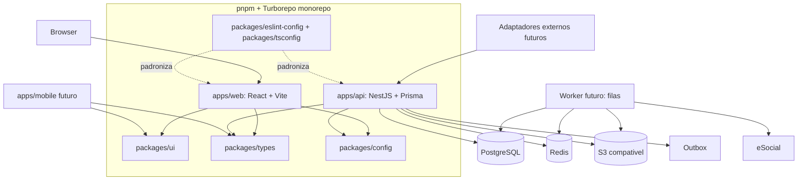

# Arquitetura do Sistema

## 1. Visão arquitetural

O ERP será um monólito modular orientado a domínio, operado em contêineres Docker. A escolha privilegia consistência de folha, menor custo operacional e fronteiras claras para futura extração de serviços, caso o uso justifique.



## 2. Estrutura de módulos

| Módulo       | Responsabilidade                                        | Não pode assumir                           |
| ------------ | ------------------------------------------------------- | ------------------------------------------ |
| identity     | Usuários, sessões, papéis e permissões                  | Regras de DP                               |
| organization | Empresas e estrutura organizacional                     | Dados pessoais                             |
| people       | Pessoa, documentos, dependentes e notas                 | Cálculo de folha                           |
| employment   | Vínculos, histórico e remuneração contratual            | Pagamento de folha                         |
| benefits     | Catálogo, adesão e desconto recorrente                  | Decidir imposto/encargo                    |
| time         | Jornada, ponto e banco de horas                         | Fechar folha                               |
| leave        | Férias, afastamentos e prazos                           | Transmitir integração diretamente          |
| payroll      | Calendário, rubricas, cálculo, conferência e fechamento | Manipular dados internos de outros módulos |
| documents    | Templates, geração, armazenamento e assinatura          | Alterar estado contratual sem caso de uso  |
| workflow     | Checklists, tarefas, aprovações e notificações          | Executar cálculo de domínio                |
| termination  | Caso e pendências de desligamento                       | Duplicar cálculo de folha                  |
| integrations | Adaptadores externos, eSocial e importações             | Conter regras legais fora do domínio       |
| reporting    | Consultas, exportações e indicadores                    | Alterar dados operacionais                 |

## 2.1 Estrutura do monorepo

```text
apps/          Aplicações executáveis e independentes
  web/         Interface React/Vite
  api/         API NestJS, Prisma e adaptadores de infraestrutura
packages/      Código reutilizável, sem detalhes de negócio específicos
  ui/          Componentes visuais acessíveis e sem chamadas HTTP
  types/       Contratos seguros, tipos transversais e tipos de API
  config/      Utilitários e convenções de configuração compartilhada
  eslint-config/ Regras de lint reutilizadas
  tsconfig/    Configurações TypeScript reutilizadas
docker/        Dockerfiles de aplicações
scripts/       Automações de repositório futuras
```

`apps/mobile` será acrescentado quando houver requisito aprovado. Ele poderá consumir `types`, `ui` quando tecnicamente compatível e `config`, sem acessar Prisma ou módulos internos da API.

## 3. Camadas internas

```text
presentation  -> controllers, DTOs, autenticação de borda
application   -> casos de uso, transações, autorização e orquestração
domain        -> entidades, value objects, serviços, políticas e eventos
infrastructure-> ORM, repositórios, filas, arquivos e adaptadores externos
```

Dependências apontam para dentro. O domínio não conhece HTTP, ORM, Redis, armazenamento de arquivos ou eSocial. Regras de negócio ficam em entidades, políticas e serviços de domínio; controllers nunca calculam regras trabalhistas.

## 4. Comunicação frontend x backend

- Frontend comunica-se somente com a API por HTTPS, REST/JSON e contrato OpenAPI versionado. `packages/types` contém apenas contratos seguros compartilháveis; o OpenAPI continua sendo a fonte pública da API.
- A API devolve erros padronizados com código, mensagem segura, campos e `traceId`.
- Listagens são paginadas, filtráveis e ordenáveis por campos permitidos.
- Operações de escrita exigem autenticação, autorização e token de idempotência quando houver risco de duplicação.
- Arquivos são enviados por fluxo autorizado; o browser não obtém credencial direta de armazenamento.
- Cálculos, importações, geração de documentos e integrações retornam identificador de operação e são acompanhados por status assíncrono.

## 4.1 Estrutura visual inicial do frontend

O `apps/web` possui um application shell local à aplicação, composto por sidebar responsiva, header, breadcrumbs e área de rota. Caminhos, rótulos, ícones e descrições dos módulos ficam em uma única configuração de navegação; sidebar, menu mobile e breadcrumbs a consomem sem duplicar a estrutura. O shell não realiza chamadas HTTP nem concentra estado global: o estado de apresentação da sidebar e do menu mobile permanece no próprio layout. Consulte [Application Shell](../frontend/APPLICATION_SHELL.md).

## 5. Serviços de domínio principais

| Serviço                   | Responsabilidade                                                   |
| ------------------------- | ------------------------------------------------------------------ |
| ContractLifecycleService  | Validar início, alteração, recontratação e encerramento de vínculo |
| EligibilityService        | Determinar elegibilidade de benefício por contrato e vigência      |
| TimeBalanceService        | Consolidar saldo e converter ocorrências aprovadas                 |
| VacationAccrualService    | Apurar períodos, limites e vencimentos de férias                   |
| PayrollCalculationService | Orquestrar cálculo determinístico por competência e contrato       |
| RubricEvaluationService   | Avaliar rubricas e incidências por versão vigente                  |
| TerminationService        | Validar caso, pendências e composição de verbas rescisórias        |
| DocumentGenerationService | Preencher template aprovado com dados autorizados                  |
| EsocialSubmissionService  | Preparar, transmitir, reprocessar e conciliar eventos              |
| ImportValidationService   | Validar, pré-visualizar e aplicar importações idempotentes         |

## 6. Padrões adotados

- DDD tático onde houver complexidade: agregados, value objects, serviços e eventos de domínio.
- Arquitetura hexagonal/ports and adapters para infraestrutura e integrações.
- CQRS leve: comandos para alterações e consultas otimizadas para leitura, sem duplicar domínio.
- Transactional outbox para publicar eventos após commit.
- Estratégia e versão para regras de rubrica, tabelas legais e adaptadores eSocial.
- Specification/policy para elegibilidade e validações compostas.
- Repository por agregado; consultas analíticas não usam repositório de escrita.

## 7. Dados, segurança e operação

- PostgreSQL é a fonte transacional; Redis é cache/fila, nunca fonte definitiva.
- Arquivos e XMLs ficam em armazenamento compatível com S3, com metadados e acesso auditado no banco.
- Segredos e certificados ficam em cofre de segredos; o banco armazena apenas referência segura.
- RBAC por organização e empresa, complementado por permissão de dado sensível.
- Logs não podem registrar CPF, dados bancários, documentos, payloads integrais ou senhas.
- Backups, restauração testada, monitoramento, métricas de fila e alertas de falha são obrigatórios antes da produção.

## 8. Compatibilidade Docker

Ambientes terão contêineres separados para web, API, worker futuro, PostgreSQL, Redis e armazenamento local compatível com S3 em desenvolvimento. Dockerfiles ficam em `docker/`; configuração será fornecida por variáveis de ambiente, sem segredos em imagens ou repositório.

## 9. Decisões registradas

- [ADR-001 — Estratégia de migração da planilha](decisions/ADR-001-excel-migration-strategy.md)
- [ADR-002 — Fundação técnica](decisions/ADR-002-technical-foundation.md)
- [ADR-003 — Monorepo Turborepo e fronteiras de pacotes](decisions/ADR-003-monorepo-turborepo-boundaries.md)
- [ADR-004 — Compatibilidade de runtime para Prisma](decisions/ADR-004-prisma-runtime-compatibility.md)

Novas decisões que afetem estrutura, segurança, persistência, integração ou estratégia de implantação devem gerar ADR em `docs/architecture/decisions/` antes da implementação.
