# Especificação do Banco de Dados

## 1. Convenções

- Banco transacional: PostgreSQL.
- Chaves primárias: `uuid`; timestamps: `timestamptz`; valores monetários: `numeric(15,2)`; percentuais: `numeric(7,4)`.
- Todas as tabelas de domínio têm `id uuid PK`, `organization_id uuid FK`, `created_at`, `created_by`, `updated_at`, `updated_by`, `version integer not null default 1` e, quando suportam arquivamento, `deleted_at`, `deleted_by`.
- Estados são `varchar` com `CHECK`, evitando enums rígidos para regras sujeitas a mudança. Campos de origem, metadados e snapshots usam `jsonb` validado na aplicação.
- FKs usam `RESTRICT` por padrão; tabelas-filhas de agregado podem usar `CASCADE` somente antes de qualquer operação/histórico.

## 2. Tabelas por módulo

### Identidade e organização

| Tabela                  | Campos específicos (além dos campos-base)                                                                                    | Constraints e índices                                     | Relações                   |
| ----------------------- | ---------------------------------------------------------------------------------------------------------------------------- | --------------------------------------------------------- | -------------------------- |
| `organizations`         | `legal_name varchar(160)`, `status varchar(20)`                                                                              | `legal_name` único; status ativo/inativo                  | Raiz de isolamento         |
| `users`                 | `email varchar(254)`, `display_name varchar(160)`, `password_hash varchar(255)`, `status varchar(20)`, `mfa_enabled boolean` | `lower(email)` único; índice por status                   | Organização                |
| `roles`                 | `code varchar(50)`, `name varchar(100)`, `system_role boolean`                                                               | único `(organization_id, code)`                           | Organização                |
| `permissions`           | `code varchar(100)`, `description varchar(255)`                                                                              | `code` único                                              | Catálogo global            |
| `role_permissions`      | `role_id`, `permission_id`                                                                                                   | PK composta; índice por permission                        | Role, Permission           |
| `user_memberships`      | `user_id`, `company_id nullable`, `status varchar(20)`                                                                       | único `(user_id, company_id)`                             | User, Company              |
| `user_role_assignments` | `membership_id`, `role_id`                                                                                                   | único `(membership_id, role_id)`                          | Membership, Role           |
| `user_sessions`         | `user_id`, `token_hash varchar(255)`, `expires_at`, `revoked_at`                                                             | token único; índice por usuário/expiração                 | User                       |
| `companies`             | `legal_name`, `trade_name`, `tax_id varchar(20)`, `status`                                                                   | tax_id único por organização; índice status               | Organization               |
| `establishments`        | `company_id`, `name`, `tax_id nullable`, `address jsonb`, `status`                                                           | único `(company_id, tax_id)` quando preenchido            | Company                    |
| `departments`           | `company_id`, `parent_department_id nullable`, `code`, `name`, `valid_from`, `valid_to`                                      | único `(company_id, code, valid_from)`; índice hierarquia | Company, Department        |
| `cost_centers`          | `company_id`, `code`, `name`, `status`                                                                                       | único `(company_id, code)`                                | Company                    |
| `job_positions`         | `company_id`, `code`, `name`, `cbo_code nullable`, `status`                                                                  | único `(company_id, code)`                                | Company                    |
| `work_schedules`        | `company_id`, `code`, `weekly_hours numeric(5,2)`, `definition jsonb`, `status`                                              | único `(company_id, code)`; horas > 0                     | Company                    |
| `collective_agreements` | `company_id`, `union_name`, `reference`, `valid_from`, `valid_to`, `document_id nullable`                                    | único `(company_id, reference, valid_from)`               | Company, GeneratedDocument |

### Pessoa e vínculo

| Tabela                        | Campos específicos                                                                                                                                      | Constraints e índices                                                   | Relações                    |
| ----------------------------- | ------------------------------------------------------------------------------------------------------------------------------------------------------- | ----------------------------------------------------------------------- | --------------------------- |
| `employees`                   | `legal_name`, `preferred_name nullable`, `tax_id_encrypted bytea nullable`, `birth_date date nullable`, `status`                                        | hash de CPF único por organização quando preenchido; índice nome/status | Organization                |
| `employee_external_ids`       | `employee_id`, `company_id nullable`, `type`, `value`                                                                                                   | único `(organization_id, company_id, type, value)`                      | Employee, Company           |
| `employee_addresses`          | `employee_id`, `type`, `postal_code`, `address jsonb`, `valid_from`, `valid_to`                                                                         | um endereço principal vigente por pessoa                                | Employee                    |
| `employee_dependents`         | `employee_id`, `name`, `tax_id_encrypted nullable`, `birth_date`, `relationship`, `irrf_eligible boolean`                                               | índice employee/ativo                                                   | Employee                    |
| `employee_bank_accounts`      | `employee_id`, `bank_code`, `branch`, `account_encrypted bytea`, `account_hash`, `valid_from`, `valid_to`                                               | índice hash; apenas uma principal vigente                               | Employee                    |
| `employee_documents`          | `employee_id`, `type`, `number_encrypted`, `issuer`, `issued_at`, `expires_at`, `file_key`, `status`                                                    | índice employee/tipo/validade; `file_key` único                         | Employee                    |
| `employee_notes`              | `employee_id`, `body_encrypted bytea`, `visibility`, `status`                                                                                           | índice employee/visibility                                              | Employee                    |
| `employee_compliance_records` | `employee_id`, `type`, `issued_at`, `expires_at`, `evidence_document_id nullable`, `status`                                                             | único condicional por tipo/vigência; índice expiração                   | Employee, GeneratedDocument |
| `employee_deadlines`          | `employee_id`, `contract_id nullable`, `type`, `due_date`, `source`, `status`                                                                           | único `(employee_id, contract_id, type, due_date)`                      | Employee, Contract          |
| `employee_assets`             | `employee_id`, `type`, `description`, `delivered_at`, `returned_at`, `size nullable`, `status`                                                          | índice employee/status                                                  | Employee                    |
| `employment_contracts`        | `employee_id`, `company_id`, `registration_number`, `type`, `start_date`, `end_date nullable`, `status`, `esocial_category nullable`                    | único `(company_id, registration_number)`; índice employee/status/datas | Employee, Company           |
| `contract_assignments`        | `contract_id`, `department_id`, `job_position_id`, `establishment_id nullable`, `cost_center_id nullable`, `work_schedule_id`, `valid_from`, `valid_to` | sem sobreposição por contrato; índice contrato/vigência                 | Contract e estrutura        |
| `compensation_histories`      | `contract_id`, `base_salary`, `currency char(3)`, `valid_from`, `valid_to`, `reason`                                                                    | salário >= 0; sem sobreposição por contrato                             | Contract                    |
| `probation_periods`           | `contract_id`, `sequence smallint`, `start_date`, `end_date`, `status`                                                                                  | único `(contract_id, sequence)`; datas válidas                          | Contract                    |

### Benefícios, jornada, férias e afastamentos

| Tabela                 | Campos específicos                                                                                                                       | Constraints e índices                                         | Relações                 |
| ---------------------- | ---------------------------------------------------------------------------------------------------------------------------------------- | ------------------------------------------------------------- | ------------------------ |
| `benefits`             | `company_id`, `code`, `name`, `type`, `status`                                                                                           | único `(company_id, code)`                                    | Company                  |
| `benefit_plans`        | `benefit_id`, `name`, `rules jsonb`, `valid_from`, `valid_to`, `status`                                                                  | único `(benefit_id, name, valid_from)`                        | Benefit                  |
| `benefit_enrollments`  | `contract_id`, `benefit_plan_id`, `start_date`, `end_date`, `employee_amount`, `company_amount`, `status`, `waiver_document_id nullable` | uma adesão vigente por plano/contrato; valores >=0            | Contract, Plan, Document |
| `recurring_deductions` | `contract_id`, `rubric_id nullable`, `type`, `amount`, `percentage`, `valid_from`, `valid_to`, `status`                                  | valor ou percentual obrigatório; índice contrato/vigência     | Contract, Rubric         |
| `garnishments`         | `contract_id`, `type`, `process_number nullable`, `amount`, `percentage`, `valid_from`, `valid_to`, `status`                             | valor ou percentual; índice contrato/status                   | Contract                 |
| `holidays`             | `company_id nullable`, `date`, `name`, `scope`                                                                                           | único `(company_id, date, name)`                              | Company opcional         |
| `time_import_batches`  | `company_id`, `reference_date`, `source`, `status`, `file_key nullable`, `summary jsonb`                                                 | índice empresa/data/status                                    | Company                  |
| `time_events`          | `contract_id`, `occurred_on`, `type`, `quantity_minutes`, `source`, `approval_status`, `time_import_batch_id nullable`, `metadata jsonb` | único de idempotência por origem; índice contrato/data/status | Contract, ImportBatch    |
| `time_balances`        | `contract_id`, `reference_period date`, `minutes`, `expires_on nullable`, `status`                                                       | único `(contract_id, reference_period)`                       | Contract                 |
| `vacation_periods`     | `contract_id`, `accrual_start`, `accrual_end`, `grant_deadline`, `status`                                                                | único `(contract_id, accrual_start)`                          | Contract                 |
| `vacation_requests`    | `vacation_period_id`, `start_date`, `end_date`, `sold_days smallint`, `status`, `approved_by nullable`                                   | dias e datas válidos; índice período/status                   | VacationPeriod, User     |
| `leave_cases`          | `contract_id`, `type`, `start_date`, `end_date nullable`, `return_date nullable`, `status`, `evidence_document_id nullable`              | índice contrato/status/datas                                  | Contract, Document       |

### Folha, rescisão, documentos e integração

| Tabela                         | Campos específicos                                                                                                               | Constraints e índices                                    | Relações                        |
| ------------------------------ | -------------------------------------------------------------------------------------------------------------------------------- | -------------------------------------------------------- | ------------------------------- |
| `payroll_calendars`            | `company_id`, `name`, `rules jsonb`, `status`                                                                                    | único `(company_id, name)`                               | Company                         |
| `payroll_periods`              | `company_id`, `calendar_id`, `reference date`, `type`, `status`, `opened_at`, `closed_at nullable`                               | único `(company_id, reference, type)`                    | Company, Calendar               |
| `rubrics`                      | `company_id`, `code`, `name`, `nature_code`, `status`                                                                            | único `(company_id, code)`                               | Company                         |
| `rubric_versions`              | `rubric_id`, `valid_from`, `valid_to`, `calculation_expression jsonb`, `incidences jsonb`, `priority`                            | sem sobreposição por rubrica; índice vigência/prioridade | Rubric                          |
| `statutory_tables`             | `company_id nullable`, `type`, `valid_from`, `valid_to`, `data jsonb`, `source_reference`                                        | único `(company_id, type, valid_from)`                   | Company opcional                |
| `payroll_runs`                 | `payroll_period_id`, `sequence`, `status`, `started_at`, `finished_at nullable`, `approved_by nullable`, `snapshot jsonb`        | único `(period_id, sequence)`                            | PayrollPeriod, User             |
| `payroll_run_employees`        | `payroll_run_id`, `contract_id`, `status`, `gross_amount`, `net_amount`, `calculation_snapshot jsonb`                            | único `(run_id, contract_id)`                            | PayrollRun, Contract            |
| `payroll_inputs`               | `payroll_period_id`, `contract_id`, `rubric_id`, `amount`, `quantity`, `source`, `approval_status`, `idempotency_key nullable`   | único de idempotência; índice período/contrato/status    | Period, Contract, Rubric        |
| `payroll_calculation_items`    | `payroll_run_employee_id`, `rubric_id`, `rubric_version_id`, `amount`, `quantity`, `base_amount`, `metadata jsonb`               | único `(run_employee_id, rubric_id, rubric_version_id)`  | RunEmployee, Rubric, Version    |
| `variable_compensation_events` | `contract_id`, `reference_period`, `type`, `amount`, `policy_reference`, `approval_status`                                       | índice contrato/período/status                           | Contract                        |
| `salary_advances`              | `contract_id`, `reference_period`, `amount`, `status`, `payment_date nullable`                                                   | valor >0; índice contrato/período                        | Contract                        |
| `off_cycle_payments`           | `contract_id`, `reference_period`, `amount`, `reason`, `approval_status`, `paid_at nullable`                                     | valor >0; índice período/status                          | Contract                        |
| `payroll_reconciliations`      | `payroll_run_id`, `type`, `status`, `difference_amount`, `notes`, `resolved_by nullable`                                         | índice run/status                                        | PayrollRun, User                |
| `payment_guides`               | `payroll_period_id`, `type`, `amount`, `due_date`, `status`, `file_key nullable`                                                 | único `(period_id, type)`                                | PayrollPeriod                   |
| `termination_cases`            | `contract_id`, `type`, `reason`, `notice_date`, `termination_date`, `status`, `approved_by nullable`                             | um caso aberto por contrato; índice status/data          | Contract, User                  |
| `termination_tasks`            | `termination_case_id`, `code`, `description`, `status`, `assigned_to nullable`, `due_date nullable`                              | único `(case_id, code)`                                  | TerminationCase, User           |
| `checklist_templates`          | `company_id nullable`, `type`, `name`, `version`, `status`                                                                       | único `(company_id, type, version)`                      | Company opcional                |
| `checklist_template_items`     | `template_id`, `code`, `description`, `required`, `position`                                                                     | único `(template_id, code)`                              | Template                        |
| `checklist_instances`          | `template_id`, `contract_id nullable`, `termination_case_id nullable`, `status`, `context jsonb`                                 | um contexto ativo por tipo; índice status                | Template, Contract, Termination |
| `checklist_items`              | `instance_id`, `template_item_id`, `status`, `completed_by nullable`, `completed_at nullable`, `evidence_document_id nullable`   | único `(instance_id, template_item_id)`                  | Instance, Item, User, Document  |
| `document_templates`           | `company_id nullable`, `code`, `version`, `content_key`, `status`, `valid_from`, `valid_to`                                      | único `(company_id, code, version)`                      | Company opcional                |
| `generated_documents`          | `template_id nullable`, `employee_id nullable`, `contract_id nullable`, `type`, `file_key`, `status`, `payload_snapshot jsonb`   | `file_key` único; índice contexto/tipo                   | Template, Employee, Contract    |
| `document_signatures`          | `document_id`, `signer_type`, `signer_id nullable`, `status`, `signed_at nullable`, `provider_reference nullable`                | índice documento/status                                  | GeneratedDocument               |
| `integration_connections`      | `company_id`, `type`, `status`, `secret_reference`, `configuration jsonb`                                                        | único `(company_id, type)`                               | Company                         |
| `esocial_events`               | `company_id`, `contract_id nullable`, `payroll_period_id nullable`, `event_type`, `event_id`, `payload_key`, `status`, `version` | `event_id` único; índice status/tipo                     | Company, Contract, Period       |
| `esocial_submissions`          | `event_id`, `attempt`, `submitted_at`, `status`, `response_key nullable`, `error_code nullable`                                  | único `(event_id, attempt)`                              | EsocialEvent                    |
| `esocial_receipts`             | `event_id`, `receipt_number`, `received_at`, `payload_key nullable`                                                              | receipt único                                            | EsocialEvent                    |

### Plataforma, importação e auditoria

| Tabela                | Campos específicos                                                                                                                                        | Constraints e índices                         | Relações      |
| --------------------- | --------------------------------------------------------------------------------------------------------------------------------------------------------- | --------------------------------------------- | ------------- |
| `data_import_batches` | `company_id nullable`, `type`, `source_file_key`, `status`, `idempotency_key`, `summary jsonb`                                                            | idempotency única; índice status              | Company       |
| `data_import_errors`  | `batch_id`, `row_number`, `field`, `code`, `message`, `raw_value_encrypted nullable`                                                                      | índice batch/linha                            | ImportBatch   |
| `notifications`       | `user_id`, `type`, `title`, `body`, `status`, `read_at nullable`, `context jsonb`                                                                         | índice usuário/status/data                    | User          |
| `outbox_events`       | `aggregate_type`, `aggregate_id`, `event_type`, `payload jsonb`, `occurred_at`, `published_at nullable`, `attempts`                                       | índice publicação/ocorrência                  | Organização   |
| `audit_logs`          | `actor_user_id nullable`, `company_id nullable`, `entity_type`, `entity_id`, `action`, `before_data jsonb`, `after_data jsonb`, `trace_id`, `occurred_at` | índice entidade/data, ator/data, empresa/data | User, Company |

## 3. Diagrama lógico completo

```mermaid
erDiagram
  ORGANIZATIONS ||--o{ COMPANIES : owns
  ORGANIZATIONS ||--o{ USERS : contains
  USERS ||--o{ USER_MEMBERSHIPS : has
  USERS ||--o{ USER_SESSIONS : opens
  COMPANIES ||--o{ USER_MEMBERSHIPS : scopes
  USER_MEMBERSHIPS ||--o{ USER_ROLE_ASSIGNMENTS : receives
  ROLES ||--o{ USER_ROLE_ASSIGNMENTS : grants
  ROLES ||--o{ ROLE_PERMISSIONS : includes
  PERMISSIONS ||--o{ ROLE_PERMISSIONS : defines
  COMPANIES ||--o{ ESTABLISHMENTS : has
  COMPANIES ||--o{ DEPARTMENTS : has
  DEPARTMENTS ||--o{ DEPARTMENTS : parent_of
  COMPANIES ||--o{ COST_CENTERS : has
  COMPANIES ||--o{ JOB_POSITIONS : has
  COMPANIES ||--o{ WORK_SCHEDULES : has
  COMPANIES ||--o{ COLLECTIVE_AGREEMENTS : signs
  ORGANIZATIONS ||--o{ EMPLOYEES : contains
  EMPLOYEES ||--o{ EMPLOYEE_EXTERNAL_IDS : identifies
  EMPLOYEES ||--o{ EMPLOYEE_ADDRESSES : has
  EMPLOYEES ||--o{ EMPLOYEE_DEPENDENTS : has
  EMPLOYEES ||--o{ EMPLOYEE_BANK_ACCOUNTS : has
  EMPLOYEES ||--o{ EMPLOYEE_DOCUMENTS : owns
  EMPLOYEES ||--o{ EMPLOYEE_NOTES : receives
  EMPLOYEES ||--o{ EMPLOYEE_COMPLIANCE_RECORDS : complies
  EMPLOYEES ||--o{ EMPLOYEE_DEADLINES : tracks
  EMPLOYEES ||--o{ EMPLOYEE_ASSETS : receives
  EMPLOYEES ||--o{ EMPLOYMENT_CONTRACTS : holds
  COMPANIES ||--o{ EMPLOYMENT_CONTRACTS : employs
  EMPLOYMENT_CONTRACTS ||--o{ CONTRACT_ASSIGNMENTS : changes
  DEPARTMENTS ||--o{ CONTRACT_ASSIGNMENTS : allocates
  JOB_POSITIONS ||--o{ CONTRACT_ASSIGNMENTS : assigns
  WORK_SCHEDULES ||--o{ CONTRACT_ASSIGNMENTS : schedules
  EMPLOYMENT_CONTRACTS ||--o{ COMPENSATION_HISTORIES : pays
  EMPLOYMENT_CONTRACTS ||--o{ PROBATION_PERIODS : evaluates
  BENEFITS ||--o{ BENEFIT_PLANS : offers
  EMPLOYMENT_CONTRACTS ||--o{ BENEFIT_ENROLLMENTS : enrolls
  BENEFIT_PLANS ||--o{ BENEFIT_ENROLLMENTS : selected
  EMPLOYMENT_CONTRACTS ||--o{ RECURRING_DEDUCTIONS : deducts
  EMPLOYMENT_CONTRACTS ||--o{ GARNISHMENTS : enforces
  COMPANIES ||--o{ HOLIDAYS : observes
  EMPLOYMENT_CONTRACTS ||--o{ TIME_EVENTS : produces
  TIME_IMPORT_BATCHES ||--o{ TIME_EVENTS : imports
  EMPLOYMENT_CONTRACTS ||--o{ TIME_BALANCES : balances
  EMPLOYMENT_CONTRACTS ||--o{ VACATION_PERIODS : accrues
  VACATION_PERIODS ||--o{ VACATION_REQUESTS : grants
  EMPLOYMENT_CONTRACTS ||--o{ LEAVE_CASES : pauses
  COMPANIES ||--o{ PAYROLL_PERIODS : owns
  PAYROLL_CALENDARS ||--o{ PAYROLL_PERIODS : defines
  PAYROLL_PERIODS ||--o{ PAYROLL_RUNS : executes
  PAYROLL_RUNS ||--o{ PAYROLL_RUN_EMPLOYEES : calculates
  EMPLOYMENT_CONTRACTS ||--o{ PAYROLL_RUN_EMPLOYEES : receives
  PAYROLL_PERIODS ||--o{ PAYROLL_INPUTS : contains
  EMPLOYMENT_CONTRACTS ||--o{ PAYROLL_INPUTS : receives
  RUBRICS ||--o{ RUBRIC_VERSIONS : versions
  COMPANIES ||--o{ STATUTORY_TABLES : configures
  RUBRICS ||--o{ PAYROLL_INPUTS : classifies
  PAYROLL_RUN_EMPLOYEES ||--o{ PAYROLL_CALCULATION_ITEMS : produces
  RUBRIC_VERSIONS ||--o{ PAYROLL_CALCULATION_ITEMS : applies
  EMPLOYMENT_CONTRACTS ||--o{ VARIABLE_COMPENSATION_EVENTS : earns
  EMPLOYMENT_CONTRACTS ||--o{ SALARY_ADVANCES : receives
  EMPLOYMENT_CONTRACTS ||--o{ OFF_CYCLE_PAYMENTS : receives
  PAYROLL_RUNS ||--o{ PAYROLL_RECONCILIATIONS : reconciles
  PAYROLL_PERIODS ||--o{ PAYMENT_GUIDES : generates
  EMPLOYMENT_CONTRACTS ||--o{ TERMINATION_CASES : ends
  TERMINATION_CASES ||--o{ TERMINATION_TASKS : requires
  CHECKLIST_TEMPLATES ||--o{ CHECKLIST_TEMPLATE_ITEMS : contains
  CHECKLIST_TEMPLATES ||--o{ CHECKLIST_INSTANCES : instantiates
  CHECKLIST_INSTANCES ||--o{ CHECKLIST_ITEMS : tracks
  DOCUMENT_TEMPLATES ||--o{ GENERATED_DOCUMENTS : generates
  GENERATED_DOCUMENTS ||--o{ DOCUMENT_SIGNATURES : signs
  COMPANIES ||--o{ INTEGRATION_CONNECTIONS : configures
  COMPANIES ||--o{ ESOCIAL_EVENTS : sends
  ESOCIAL_EVENTS ||--o{ ESOCIAL_SUBMISSIONS : attempts
  ESOCIAL_EVENTS ||--o{ ESOCIAL_RECEIPTS : receives
  DATA_IMPORT_BATCHES ||--o{ DATA_IMPORT_ERRORS : reports
  USERS ||--o{ NOTIFICATIONS : receives
  ORGANIZATIONS ||--o{ OUTBOX_EVENTS : publishes
  USERS ||--o{ AUDIT_LOGS : acts
```

## 4. Histórico de alterações e auditoria

- Dados de vigência usam tabelas de histórico (`contract_assignments`, `compensation_histories`, `rubric_versions`) e não atualização destrutiva.
- Operações relevantes geram `audit_logs` com ator, contexto, antes/depois minimizados, `trace_id` e data. Dados sensíveis são mascarados ou referenciados, nunca gravados em claro no log.
- Folha fechada mantém `snapshot` de entrada, regras e resultado; versões posteriores não alteram sua reprodução.
- `outbox_events` preserva publicação confiável e rastreabilidade entre transação e processos assíncronos.

## 5. Estratégia de soft delete

- Tabelas de catálogo e cadastros usam `deleted_at`, `deleted_by` e `status`; consultas operacionais filtram registros removidos por padrão.
- Entidades financeiras, folha, integração, auditoria, documentos gerados e eventos históricos não recebem soft delete: são canceladas, estornadas ou substituídas por evento corretivo.
- Uma entidade com referências ativas não pode ser arquivada sem regra de substituição ou encerramento de vigência.
- Restauração exige permissão administrativa, justificativa e auditoria.

## 6. Regras de integridade adicionais

1. Vigências do mesmo tipo não podem se sobrepor para um mesmo contrato/rubrica.
2. Chaves externas e matrícula devem ter unicidade no escopo correto de empresa.
3. Valores monetários não aceitam precisão binária; sempre `numeric`.
4. Arquivos são identificados por chave de objeto; conteúdo não é armazenado no banco.
5. Índices parciais serão usados para registros ativos e chaves únicas opcionais.
6. Restrições de exclusão, fechamento de folha e segregação de funções também serão validadas no domínio, não apenas no banco.
