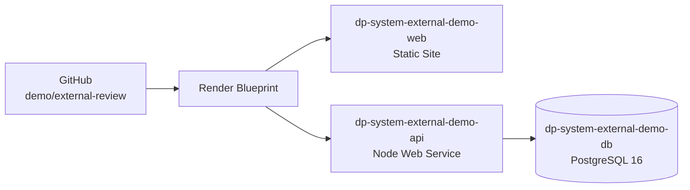

# DP-System external demo

## Status

`PREPARED — EXTERNAL PROVIDER CONNECTION REQUIRED`

This package prepares an isolated external demonstration of `dp-system` from
`demo/external-review`. It does not authorize production, real data, Wave 3, Gate D, ETP-015.10,
or any merge. The audited baseline is `develop@8c10b66a5ae25e961b445938c8e9758e720133bf`.

## Purpose and boundaries

The environment exists only for a named external reviewer to evaluate the application in a web
browser over HTTPS. All records are deterministic or clearly fictitious. Company, employee,
payroll, audit, and authentication data from any real organization are prohibited.

The scoped human authorization for this package supersedes earlier statements that external
deployment was not authorized, but only for this isolated non-production demo. It does not change
the production status of the project.

## Architecture

- The static site builds `apps/web` and rewrites all SPA routes to `index.html`.
- The API builds `apps/api`, runs `prisma migrate deploy` before start, and starts with the
  repository's `start:prod` command.
- The database is exclusive to this demo and has no public inbound IP range.
- Redis is not provisioned. No package or application module uses Redis at runtime; references are
  limited to local demo orchestration.

The Blueprint follows Render's current [Blueprint specification](https://render.com/docs/blueprint-spec),
[monorepo guidance](https://render.com/docs/monorepo-support), and
[health-check contract](https://render.com/docs/health-checks).

## Runtime contract

- Node.js: `>=20.17.0 <21`
- pnpm: `9.15.5`
- API build: `pnpm prisma:generate && pnpm --filter @dp-system/api build`
- API pre-deploy: `pnpm prisma:migrate:deploy`
- API start: `pnpm --filter @dp-system/api start:prod`
- Web build: `pnpm --filter @dp-system/web build`
- Web publish directory: `apps/web/dist`
- API health check: `/api/v1/health/live`

The API honors Render's dynamic `PORT`. `API_PORT` remains only a local fallback. The production
Node optimization flag is `NODE_ENV=production`, while the deployment classification is separately
and explicitly locked to `DEPLOYMENT_ENV=external-demo`.

## Security properties

- CORS accepts only the exact HTTPS static-site origin supplied through `CORS_ORIGINS`.
- Swagger is disabled.
- Helmet, validation pipes, global route authorization, company context, rate limiting, request
  correlation, and audit sanitization remain enabled.
- The frontend receives only the exact public API base URL through `VITE_API_URL`.
- The UI persistently identifies `Demo externa · Dados fictícios` without exposing local demo
  credentials.
- `JWT_SECRET`, `DATABASE_URL`, and reviewer password are provider-managed values and never enter
  Git, documentation, CI output, or the PR body.
- No external integration, webhook, email, banking, WhatsApp, ERP, or real payroll service is
  configured.

## Demonstration identities and access

The external seed creates disabled technical placeholders so that deterministic historical records
can be built without publishing a login. It creates no `RolePermission` assignment.

The reviewer is activated only by `pnpm external-demo:reviewer:provision`, using
`EXTERNAL_DEMO_REVIEWER_EMAIL` and `EXTERNAL_DEMO_REVIEWER_PASSWORD`. The local identities and
known local passwords are explicitly rejected.

Access is granted separately by `pnpm external-demo:access:grant`:

- source type `MANUAL`;
- exactly the 35 capabilities already approved for the demonstrative access profile;
- no `platform.manage` bypass or super-capability;
- maximum lifetime of 8 hours;
- no automatic HR grant;
- idempotent grant and revocation;
- append-preserving, audited assignment governance.

## URLs

No public URL exists in the repository. Record only the HTTPS URLs actually assigned by Render
after the human provider connection. Until then:

- Frontend: `NOT AVAILABLE`
- API: `NOT AVAILABLE`

Environment variables are defined in [EXTERNAL_DEMO_ENV.md](./EXTERNAL_DEMO_ENV.md). Provisioning,
verification, renewal, revocation, shutdown, and destruction procedures are in
[EXTERNAL_DEMO_RUNBOOK.md](./EXTERNAL_DEMO_RUNBOOK.md).
