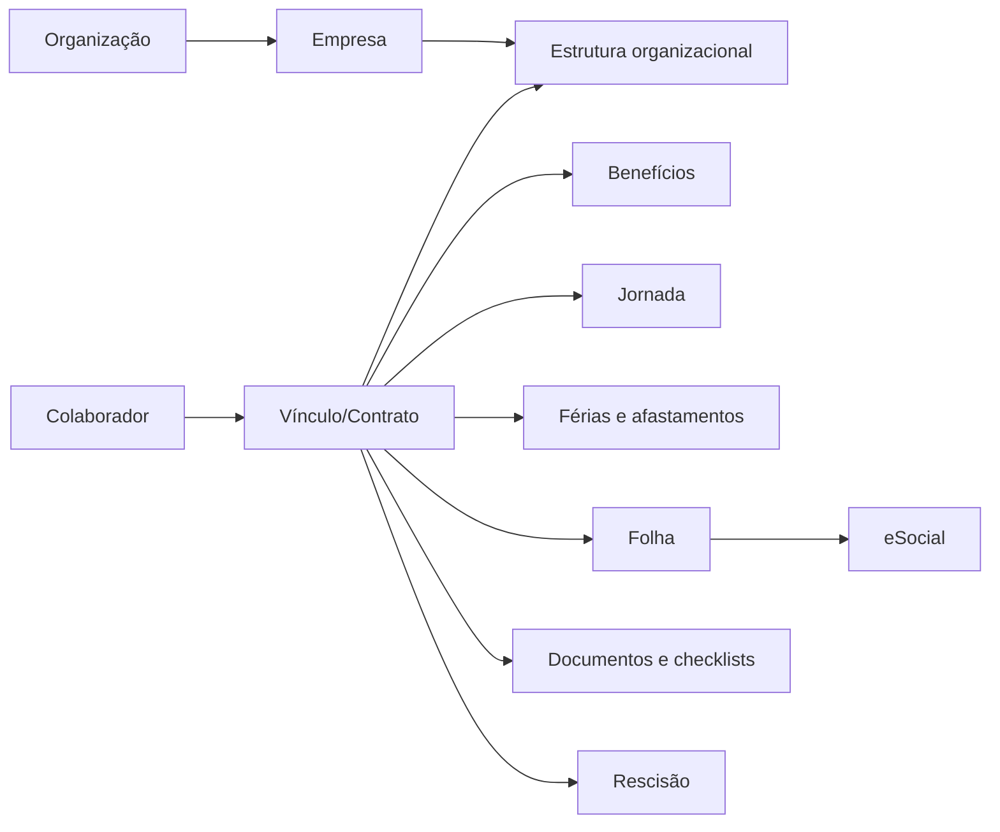

# Modelo de Domínio do ERP de Departamento Pessoal

## 1. Limites do domínio

O ERP administra relações de trabalho para múltiplas empresas de uma mesma organização. O núcleo é o vínculo empregatício, seus eventos e seus efeitos em jornada, benefícios, documentos, férias, folha, desligamento e obrigações.

## 2. Entidades e responsabilidades

| Módulo                | Entidades                                                                                                               | Responsabilidade                                                                         |
| --------------------- | ----------------------------------------------------------------------------------------------------------------------- | ---------------------------------------------------------------------------------------- |
| Identidade            | Organization, User, Role, Permission, Membership                                                                        | Isolar empresas, autenticar usuários e aplicar autorização                               |
| Estrutura             | Company, Branch, Department, CostCenter, Position, WorkSchedule, CollectiveAgreement                                    | Representar empregadores, lotações, cargos, jornadas e regras coletivas                  |
| Pessoas               | Employee, ExternalIdentifier, Address, Dependent, BankAccount, EmployeeDocument, EmployeeNote                           | Manter dados da pessoa, dados externos e informações protegidas                          |
| Vínculo               | EmploymentContract, ContractAssignment, CompensationHistory, ProbationPeriod                                            | Manter ciclo de vida do vínculo e seu histórico de empresa, cargo, jornada e remuneração |
| Benefícios            | Benefit, BenefitPlan, BenefitEnrollment, RecurringDeduction, Garnishment                                                | Definir elegibilidade, adesão, descontos recorrentes e pensões                           |
| Jornada               | Holiday, TimeImportBatch, TimeEvent, TimeBalance                                                                        | Registrar ocorrências, importar ponto e consolidar banco de horas                        |
| Férias e afastamentos | VacationPeriod, VacationRequest, LeaveCase, EmployeeDeadline                                                            | Controlar períodos, gozo, afastamentos e vencimentos obrigatórios                        |
| Folha                 | PayrollCalendar, PayrollPeriod, Rubric, RubricVersion, StatutoryTable, PayrollRun, PayrollInput, PayrollCalculationItem | Calcular, conferir, aprovar e fechar a folha com regras vigentes                         |
| Remuneração variável  | VariableCompensationEvent, SalaryAdvance, OffCyclePayment, PayrollReconciliation                                        | Registrar comissão, prêmio, adiantamento, pagamento externo e conciliação                |
| Workflow e documentos | ChecklistTemplate, ChecklistInstance, DocumentTemplate, GeneratedDocument, DocumentSignature                            | Transformar controles da planilha em tarefas, evidências e documentos versionados        |
| Rescisão              | TerminationCase, TerminationTask                                                                                        | Conduzir desligamento, pendências, cálculos e documentação                               |
| Integrações           | IntegrationConnection, EsocialEvent, EsocialSubmission, EsocialReceipt                                                  | Versionar, transmitir, acompanhar e retificar integrações externas                       |
| Plataforma            | Notification, DataImportBatch, DataImportError, OutboxEvent, AuditLog                                                   | Notificar, importar, publicar eventos e auditar operações                                |

## 3. Relacionamentos essenciais

- Uma `Organization` possui uma ou mais `Company`.
- Uma `Employee` pode possuir vários `EmploymentContract` ao longo do tempo; apenas um contrato ativo por pessoa e empresa é permitido, salvo regra validada de múltiplos vínculos.
- Um contrato possui histórico de lotação/cargo/jornada (`ContractAssignment`) e remuneração (`CompensationHistory`), ambos com vigência.
- Benefícios, férias, jornada, folha, documentos e rescisão referenciam o contrato, e não somente a pessoa.
- Uma `PayrollRun` contém uma execução por contrato (`PayrollRunEmployee`), entradas e itens calculados imutáveis após fechamento.
- Um `ChecklistInstance` e seus documentos podem ser associados a admissão, férias, afastamento ou rescisão.

## 4. Fluxos de negócio

### Admissão

1. DP cria colaborador e valida dados obrigatórios.
2. DP abre vínculo com empresa, cargo, setor, jornada, remuneração e data de admissão.
3. Sistema cria período de experiência, checklist admissional e prazos iniciais.
4. Documentos são gerados a partir de template aprovado.
5. Um responsável conclui e aprova o checklist; a integração legal é preparada quando aplicável.

### Alteração contratual

1. Usuário registra solicitação com data de vigência e justificativa.
2. O sistema cria novo histórico, sem alterar o registro vigente anterior.
3. Se a competência de folha estiver fechada, a alteração torna-se ajuste futuro/retroativo controlado.
4. A alteração é auditada e enviada à integração pertinente.

### Jornada e banco de horas

1. Ocorrências são importadas ou registradas com origem e evidência.
2. Regras de jornada classificam falta, atraso, hora extra, adicional e compensação.
3. O saldo é consolidado por contrato e competência.
4. Eventos aprovados são disponibilizados como entrada da folha, sem duplicação.

### Folha

1. DP abre competência conforme calendário.
2. Entradas aprovadas são congeladas para cálculo; rubricas e tabelas são selecionadas pela vigência.
3. O motor calcula por contrato, guarda entradas, regras e itens resultantes.
4. DP confere divergências e solicita ajustes; Financeiro confere pagamentos; Diretor aprova o fechamento conforme alçada.
5. A folha fechada torna-se imutável; correções exigem reabertura auditada.

### Férias e afastamentos

1. Sistema apura períodos e alerta prazos.
2. DP registra solicitação, gozo, abono e aprovação.
3. Eventos são refletidos na folha da competência correta.
4. Afastamentos criam caso, documentos e eventos de retorno.

### Rescisão

1. DP abre caso de rescisão com motivo, datas e modalidade.
2. Sistema instancia checklist, bloqueia pendências críticas e calcula verbas quando a folha permitir.
3. Financeiro confirma pagamento; Diretor aprova casos de sua alçada.
4. Documentos, integração e evidências são concluídos antes do encerramento.

## 5. Eventos de domínio

| Evento                           | Disparado quando              | Consumidores típicos                |
| -------------------------------- | ----------------------------- | ----------------------------------- |
| `EmployeeCreated`                | Colaborador criado            | Auditoria, checklist admissional    |
| `EmploymentContractStarted`      | Vínculo iniciado              | Prazos, benefícios, eSocial         |
| `ContractAssignmentChanged`      | Cargo/setor/jornada alterados | Folha, documentos, integração       |
| `CompensationChanged`            | Remuneração alterada          | Folha, relatórios, integração       |
| `BenefitEnrollmentChanged`       | Benefício incluído/alterado   | Folha e relatórios                  |
| `TimeEventsApproved`             | Ocorrências aprovadas         | Banco de horas e folha              |
| `VacationApproved`               | Férias aprovadas              | Documento, folha e alertas          |
| `PayrollCalculated`              | Cálculo concluído             | Conferência e relatórios            |
| `PayrollClosed`                  | Folha fechada                 | Guias, integração, auditoria        |
| `TerminationOpened`              | Rescisão iniciada             | Checklist, documentos e bloqueios   |
| `DocumentGenerated`              | Documento emitido             | Assinatura, auditoria e notificação |
| `EsocialSubmissionStatusChanged` | Retorno externo recebido      | DP, painel de pendências            |

Eventos são publicados após confirmação transacional por meio de outbox; não substituem o registro auditável da operação.

## 6. Casos de uso

| Código | Caso de uso                                                | Ator principal                |
| ------ | ---------------------------------------------------------- | ----------------------------- |
| UC-01  | Gerir empresas, estrutura e parâmetros                     | Administrador / DP autorizado |
| UC-02  | Cadastrar e atualizar colaborador                          | RH / DP                       |
| UC-03  | Criar, alterar e encerrar vínculo                          | DP                            |
| UC-04  | Importar dados saneados da planilha                        | DP autorizado                 |
| UC-05  | Gerir benefícios, descontos e pensões                      | RH / DP                       |
| UC-06  | Importar/aprovar jornada e banco de horas                  | Gestor / DP                   |
| UC-07  | Programar e aprovar férias                                 | Gestor / DP                   |
| UC-08  | Calcular, conferir, aprovar e fechar folha                 | DP / Financeiro / Diretor     |
| UC-09  | Registrar comissão, adiantamento e pagamentos excepcionais | DP / Financeiro               |
| UC-10  | Gerar documentos e controlar assinatura                    | RH / DP                       |
| UC-11  | Conduzir rescisão                                          | DP / Financeiro / Diretor     |
| UC-12  | Transmitir e acompanhar eSocial                            | DP autorizado                 |
| UC-13  | Consultar relatórios e auditoria                           | Perfis autorizados            |

## 7. Regras de negócio transversais

1. Todo dado operacional possui organização, empresa quando aplicável, autor e timestamps.
2. Dados históricos não são sobrescritos: alterações geram novos registros com vigência.
3. Não há exclusão física de dados de DP em operação normal; aplicam-se arquivamento e soft delete conforme política.
4. Uma competência fechada não pode receber alteração direta.
5. Quem calcula uma folha não pode ser o único aprovador dela; aprovação própria é proibida.
6. Uma transmissão externa deve ser idempotente e manter recibo, payload, versão e resposta.
7. Valor de folha precisa informar rubrica, origem, competência e regra aplicável.
8. Benefício, desconto e remuneração variável não entram na folha sem vigência e aprovação exigida.
9. Documentos pessoais e notas confidenciais obedecem permissão específica, além da permissão do módulo.
10. Dados derivados da planilha não são fonte canônica; a origem deve estar definida no dicionário de migração.

## 8. Glossário de DP

| Termo              | Definição no sistema                                                        |
| ------------------ | --------------------------------------------------------------------------- |
| Competência        | Mês/ano ao qual eventos e folha pertencem                                   |
| Vínculo            | Relação contratual entre colaborador e empresa                              |
| Rubrica            | Item de provento, desconto, base ou encargo de folha                        |
| Lotação            | Alocação organizacional/tributária vinculada ao contrato                    |
| Vigência           | Intervalo em que um dado ou regra é válido                                  |
| Provento           | Valor que compõe crédito ao colaborador                                     |
| Desconto           | Valor deduzido da remuneração                                               |
| Banco de horas     | Saldo controlado de horas a compensar ou pagar                              |
| Período aquisitivo | Intervalo que gera direito a férias                                         |
| Período concessivo | Intervalo em que as férias devem ser concedidas                             |
| Abono pecuniário   | Conversão permitida de parte das férias em pagamento                        |
| Afastamento        | Suspensão/alteração temporária da prestação laboral                         |
| Rescisão           | Encerramento do vínculo e apuração de verbas                                |
| RET                | Registro de eventos trabalhistas usado pelo eSocial                         |
| eSocial            | Integração governamental de eventos trabalhistas, previdenciários e fiscais |
