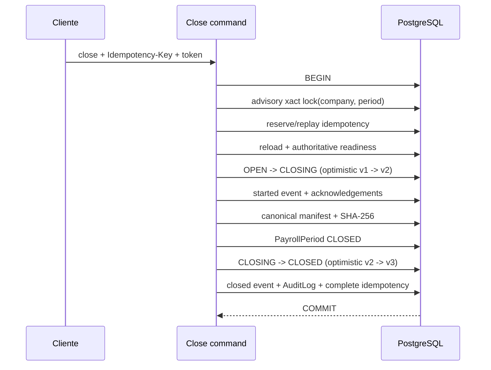

# Fechamento operacional de competência

**ETP:** 014 — Fase 4

**Status:** `READY FOR REVIEW`

**Migration:** nenhuma; reutiliza `0015_payroll_period_closure_persistence`

## Contrato canônico

`POST /api/v1/payroll-periods/:payrollPeriodId/close` executa o fechamento sob `PayrollPeriod`, exige
JWT, empresa ativa, `payroll.period.close.execute` e o header UUID `Idempotency-Key`. O corpo aceita
somente `payrollRunId`, `expectedConsistencyToken`, `warningAcknowledgements`, `note` opcional e
`expectedClosureVersion` opcional. Empresa, ator, review, totais, blockers, estado e manifesto são
sempre derivados pelo backend.

O primeiro fechamento retorna `201`; replay concluído da mesma chave e payload retorna `200`. A
resposta mínima contém competência, versão operacional, execução, review/rodada, referência e hash
do manifesto, warnings reconhecidos, ator/data, novo consistency token e trace. O manifesto completo
não é exposto.

## Fluxo transacional

Qualquer exceção aborta a transação inteira. Não permanece versão `CLOSING`, manifesto, evento de
sucesso, acknowledgement, auditoria ou reserva idempotente parcial.

## Readiness, blockers e warnings

A consulta anterior nunca autoriza o comando. O serviço recarrega o agregado na empresa ativa e
executa a mesma política de readiness usando o `Prisma.TransactionClient` que mantém o lock. O
`expectedConsistencyToken` deve coincidir com `PayrollPeriod.updatedAt`; divergência retorna
`CONSISTENCY_TOKEN_MISMATCH` (`409`) e orienta nova consulta.

Blockers são retornados juntos em `CLOSURE_READINESS_NOT_MET` (`422`). Competência já fechada usa
`PERIOD_ALREADY_CLOSED` (`409`). Nenhuma evidência de sucesso é escrita quando readiness falha.

`VARIABLE_PAY_PENDING` continua warning e exige acknowledgement explícito. Código ausente,
duplicado, não autoritativo ou que não exige reconhecimento retorna `422`. O reconhecimento é
registrado em tabela append-only, manifesto, `VARIABLE_PAY_WARNING_ACKNOWLEDGED` e `AuditLog`.
Nenhuma alçada financeira foi criada.

## Idempotência, lock e versão otimista

A chave é normalizada como UUID, armazenada somente por SHA-256 e escopada por empresa,
competência e operação `CLOSE`. O fingerprint usa JSON canônico do payload autorizado. Mesma chave
e payload retorna a evidência já persistida; payload divergente retorna
`IDEMPOTENCY_PAYLOAD_CONFLICT`; reserva sem resultado replayable retorna
`IDEMPOTENCY_OPERATION_IN_PROGRESS`.

A estratégia principal é `pg_advisory_xact_lock(hashtextextended(scope, 0))`, com SQL parametrizado,
`lock_timeout` local de cinco segundos e escopo determinístico `companyId:payrollPeriodId`. O lock é
liberado automaticamente no fim da transação. A versão otimista permanece como segunda camada:
`OPEN/v1 -> CLOSING/v2 -> CLOSED/v3`.

## Manifesto, eventos e auditoria

O manifesto é construído no servidor com `schemaVersion: 1.0`, IDs e versões, decisões válidas,
referências de achados, totais consolidados, referências mínimas de contratos, estados, warnings,
ator e contexto técnico mínimo. A serialização canônica produz SHA-256 versão
`sha256-canonical-json-v1`. Triggers impedem `UPDATE` e `DELETE`.

Eventos append-only da fase:

- `PERIOD_CLOSURE_STARTED`;
- `VARIABLE_PAY_WARNING_ACKNOWLEDGED`, quando aplicável;
- `PERIOD_CLOSED`.

Todos carregam empresa, ator, trace, sessão, IP e user-agent sanitizados. O `AuditLog`
`PAYROLL_PERIOD_CLOSED` guarda estados anterior/posterior e apenas referências seguras ao manifesto,
hash, execução, review e warnings. Evento, manifesto, estado e auditoria usam a mesma transação.

## Erros estáveis

- `IDEMPOTENCY_KEY_REQUIRED` e `IDEMPOTENCY_KEY_INVALID` — `400`;
- `IDEMPOTENCY_PAYLOAD_CONFLICT`, `IDEMPOTENCY_OPERATION_IN_PROGRESS`,
  `CONSISTENCY_TOKEN_MISMATCH`, `PERIOD_ALREADY_CLOSED`, `CONCURRENT_CLOSURE_CONFLICT` e
  `OPTIMISTIC_VERSION_CONFLICT` — `409`;
- `CLOSURE_READINESS_NOT_MET`, `WARNING_ACKNOWLEDGEMENT_REQUIRED` e
  `WARNING_ACKNOWLEDGEMENT_INVALID` — `422`;
- autenticação/autorização/escopo — `401`, `403` e `404` conforme o contrato transversal.

O filtro global preserva o código de domínio e inclui detalhes estruturados seguros, como blockers.

## Fonte da verdade e imutabilidade

`PayrollPeriod.status` é a fonte canônica do estado empresarial e passa a `CLOSED` no mesmo commit
em que a versão operacional ativa passa a `CLOSED`. A versão fornece coordenação, concorrência e
evidência. Uma versão ativa impede novo fechamento sem reabertura formal.

Manifesto, eventos e acknowledgements são imutáveis por trigger. O novo comando não altera execução
ou review. Pontos de escrita legados que podem criar execução, mudar lançamentos ou reabrir review
após o fechamento ainda não são centralizados; essa lacuna permanece para a fase de compatibilidade,
sem ampliar a refatoração nesta entrega.

## Compatibilidade e limites

A URI `POST /payroll-periods/:id/close`, antes inventariada como escrita legada insegura, é o local
homologado pela BDP-014 para o comando canônico e agora aplica o contrato v1. As demais rotas
legadas, inclusive `/payroll-closures`, `validate`, `open` e `reopen`, não foram redirecionadas,
removidas ou refatoradas; seus consumidores continuam sendo dívida explícita de compatibilidade.

Não há endpoint novo de reabertura, histórico ou manifesto, frontend, scheduler, notificação,
integração externa, alçada, retenção, exportação ou processamento assíncrono. A Fase 5 permanece
`NOT STARTED`.

## Verificação

Testes unitários cobrem fluxos válidos, warnings, blockers, token, idempotência, capability,
isolamento, versão otimista, eventos, auditoria e falhas transacionais. Testes PostgreSQL 16 cobrem
commit real, concorrência com chaves iguais/diferentes, replay, ausência de `CLOSING` residual,
unicidades, evidências append-only e escopo empresarial. As 15 migrations e o seed continuam sendo
a base completa; nenhuma assignment automática foi adicionada.
