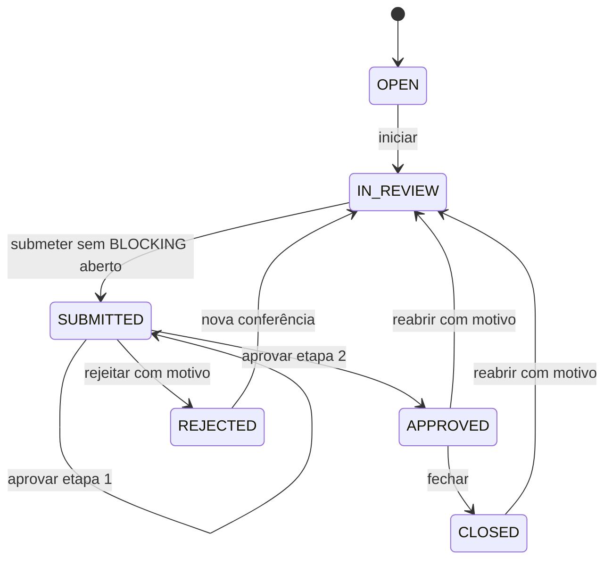

# Relatório final — ETP-013 versão 1

## Estado, objetivo e escopo

**COMPLETED — VERSION 1 em 22/07/2026.** A ETP-013 entrega conferência e aprovação de folha auditáveis no recorte aprovado pela BDP-009 v1. O backend é a fonte de verdade para identidade, empresa ativa, autorização, isolamento e transições; o frontend fornece a experiência operacional sem replicar políticas decisórias.

O encerramento considera os PRs #29 a #38, especialmente o merge do frontend pelo PR #38 (`9e68b4f`) e seus commits `36e294b`, `acd084c`, `84f4fc7` e `0688ff5`. Este relatório e a reconciliação documental compõem o commit de encerramento da branch `docs/finalize-etp-013-v1`.

Foram entregues identidade JWT, seleção validada de empresa, RBAC empresarial, grants temporários/emergenciais, auditoria transacional, ciclos, achados, workflow de duas etapas, rejeição, fechamento, reabertura, invalidação, histórico, APIs autenticadas e frontend responsivo. Não foram entregues cálculos legais, alçadas financeiras, notificações, refresh/logout de backend, scheduler, integrações externas ou integração ampla com fechamento da competência.

## Arquitetura e segurança

As invariantes ficam em `PayrollReviewFindingFoundation` e `PayrollReviewWorkflowFoundation`. Controllers aplicam JWT e capability; a aplicação repete a autorização, deriva a empresa do principal e filtra por `activeCompanyId`. `companyId` do cliente nunca é autoridade e recurso de outra empresa retorna `404`. Capacidades operacionais vêm do assignment vigente ou de grant válido; nenhum nome de papel integra regras.

O frontend mantém o access token em `sessionStorage`, seleciona a empresa por `/auth/context`, limpa cache ao trocar contexto e envia Bearer token e `x-correlation-id`. Seus guards e botões são somente controles visuais; o backend continua autorizando todas as operações.

## Persistência

| Migration                             | Entrega                              |
| ------------------------------------- | ------------------------------------ |
| `0010_identity_company_rbac`          | assignment usuário–empresa–papel     |
| `0011_authorization_audit_foundation` | auditoria, substituição e emergência |
| `0012_payroll_review_persistence`     | ciclos, achados e eventos            |
| `0013_payroll_review_workflow`        | etapas e decisões                    |
| `0014_payroll_review_close_reopen`    | `CLOSED`, rodadas e invalidações     |

O projeto possui 14 migrations (`0001`–`0014`). `PayrollReviewEvent`, `PayrollReviewDecision` e `PayrollReviewDecisionInvalidation` possuem triggers PostgreSQL que rejeitam `UPDATE` e `DELETE`.

## Workflow

Transições não desenhadas são inválidas. O preparador não aprova seu ciclo, os aprovadores são distintos, `BLOCKING` aberto impede submissão e `CLOSED` é terminal até reabertura. Reabrir incrementa a rodada e invalida aprovações antigas sem removê-las.

## Endpoints e capabilities finais

| Método e rota                                      | Capability                       |
| -------------------------------------------------- | -------------------------------- |
| `POST /payroll-runs/:payrollRunId/reviews`         | `payroll.review.create`          |
| `GET /payroll-runs/:payrollRunId/reviews`          | `payroll.review.view`            |
| `GET /payroll-reviews/:reviewCycleId`              | `payroll.review.view`            |
| `POST /payroll-reviews/:reviewCycleId/findings`    | `payroll.review.finding.create`  |
| `GET /payroll-reviews/:reviewCycleId/findings`     | `payroll.review.view`            |
| `POST /payroll-review-findings/:findingId/resolve` | `payroll.review.finding.resolve` |
| `POST /payroll-review-findings/:findingId/reopen`  | `payroll.review.finding.reopen`  |
| `POST /payroll-reviews/:reviewCycleId/start`       | `payroll.review.submit`          |
| `POST /payroll-reviews/:reviewCycleId/submit`      | `payroll.review.submit`          |
| `POST /payroll-reviews/:reviewCycleId/approve`     | `payroll.review.approve`         |
| `POST /payroll-reviews/:reviewCycleId/reject`      | `payroll.review.reject`          |
| `GET /payroll-reviews/:reviewCycleId/history`      | `payroll.review.view`            |
| `POST /payroll-reviews/:reviewCycleId/close`       | `payroll.review.close`           |
| `POST /payroll-reviews/:reviewCycleId/reopen`      | `payroll.review.reopen`          |

As dez capabilities estão no seed, decorators, aplicação e frontend aplicável. O seed não cria associação papel–capability. Rotas, métodos, DTOs, envelopes, estados e eventos usados no frontend são compatíveis com o backend. São tratados `400`, `401`, `403`, `404`, `409` e `500`. Nenhuma correção técnica foi necessária.

## Auditoria e multiempresa

- estado/evento/decisão e `AuditLog` usam o mesmo `Prisma.TransactionClient`; falha causa rollback conjunto;
- eventos, decisões e invalidações são append-only, sem endpoint de alteração ou exclusão;
- reabertura cria `APPROVALS_INVALIDATED`, invalidações individuais e `REVIEW_REOPENED`;
- o contexto propaga `actorId`, `companyId`, `traceId`, `sessionId`, IP e user-agent;
- metadata de auditoria usa allowlist e bloqueia credenciais e dados bancários;
- o assignment e a empresa ativa são revalidados em requisições protegidas;
- consultas filtram empresa na aplicação e ocultam recursos externos com `404`.

## Matriz de rastreabilidade

| Requisito            | Decisão BDP-009        | Backend / endpoint          | Capability                | Frontend           | Teste                | Status           |
| -------------------- | ---------------------- | --------------------------- | ------------------------- | ------------------ | -------------------- | ---------------- |
| Autenticação         | contexto autenticado   | auth login/me               | JWT                       | login/contexto     | auth unit/E2E/web    | Atendido         |
| Empresa ativa        | RBAC empresarial       | companies/context           | assignment                | seleção            | auth/context E2E     | Atendido         |
| RBAC e isolamento    | híbrido e `404`        | contexto/authorization      | efetivas                  | guards visuais     | guard/service        | Atendido         |
| Auditoria            | contexto completo      | AuditWriter                 | ações críticas            | correlation ID     | writer/sanitizer     | Atendido         |
| Substituição         | temporária             | access-grants/substitutions | `delegation.manage`       | UI fora da v1      | grants spec          | Backend atendido |
| Emergência           | temporária/auditada    | access-grants/emergency     | `emergency_access.manage` | UI fora da v1      | grants spec          | Backend atendido |
| Criar ciclo          | execução concluída     | create review               | create                    | detalhe execução   | service/web          | Atendido         |
| Achados              | informativo/bloqueante | findings                    | create/view               | formulário/filtros | domain/service/web   | Atendido         |
| Resolver/reabrir     | motivo/histórico       | resolve/reopen              | resolve/reopen            | diálogo            | domain/service/web   | Atendido         |
| Submeter             | sem bloqueio           | start/submit                | submit                    | ações/alerta       | workflow/service/web | Atendido         |
| Aprovar              | duas etapas            | approve/stages              | approve                   | etapa atual        | service/web          | Atendido         |
| Rejeitar             | motivo                 | reject                      | reject                    | diálogo            | workflow/service/web | Atendido         |
| Fechar               | aprovações válidas     | close                       | close                     | confirmação        | workflow/service/web | Atendido         |
| Reabrir/invalidation | nova rodada            | reopen/invalidation         | reopen                    | rodada/aviso       | service/web          | Atendido         |
| Histórico            | append-only            | history/triggers            | view                      | timeline           | service/web          | Atendido         |
| Erros                | falha explícita        | envelope                    | —                         | estados HTTP       | api/web              | Atendido         |

## Testes e métricas

- **Domínio:** specs de finding e workflow cobrem invariantes e transições.
- **Aplicação:** `payroll-reviews.service.spec.ts` cobre atomicidade, referências, multiempresa, capabilities, duas etapas, segregação, rejeição, fechamento, reabertura e rollback.
- **Identidade/segurança:** specs de auth, contexto, authorization, guard, grants, audit writer e sanitizer.
- **E2E HTTP:** `auth-context.e2e-spec.ts` cobre login, JWT, empresa, `404` e deny-by-default. Não há E2E HTTP dedicado ao controller de payroll review.
- **Frontend:** auth, API client e payroll review usam rede simulada para os fluxos funcionais e estados de erro.
- **Acessibilidade:** queries semânticas verificam labels, roles, diálogos e bloqueio textual; não há auditoria WCAG automatizada nem E2E de navegador.

| Métrica                  | Resultado real desta branch                               |
| ------------------------ | --------------------------------------------------------- |
| Migrations               | 14 (`0001`–`0014`)                                        |
| Suítes/testes API        | 38 suítes / 150 testes aprovados                          |
| Arquivos/testes frontend | 19 arquivos / 64 testes aprovados                         |
| Cobertura API            | 62,54% linhas; 64,40% branches; 41,59% funções            |
| Cobertura frontend       | 77,91% linhas; 74,18% branches; 62,20% funções            |
| Lint/typecheck/build     | aprovados por `pnpm check`                                |
| Prisma                   | generate e validate aprovados; nenhuma migration pendente |
| PostgreSQL 16 limpo      | 14 migrations, seed e 3 triggers append-only confirmados  |

## Débitos e itens fora do escopo

| Item                                 | Classificação           | Bloqueia v1? |
| ------------------------------------ | ----------------------- | ------------ |
| fechamento amplo da competência      | nova ETP                | Não          |
| retenção de auditoria / BDP-011      | decisão de negócio      | Não          |
| migração das APIs legadas            | débito técnico          | Não          |
| scheduler de expiração               | melhoria não bloqueante | Não          |
| consulta administrativa de auditoria | nova ETP                | Não          |
| refresh/logout de backend            | débito técnico          | Não          |
| notificações                         | nova ETP                | Não          |
| alçadas financeiras                  | decisão de negócio      | Não          |
| bundle/code splitting                | melhoria não bloqueante | Não          |
| hardening/observabilidade            | nova ETP                | Não          |
| integrações externas                 | nova ETP e BDP-010      | Não          |

## Critérios de aceite e conclusão

- [x] BDP-009 v1 implementada sem nomes fixos de papéis;
- [x] autenticação, empresa ativa, RBAC e isolamento;
- [x] workflow até `CLOSED`, duas etapas e segregação;
- [x] bloqueios, rejeição, reabertura, rodada e invalidação;
- [x] auditoria atômica e históricos append-only;
- [x] frontend funcional, erros e acessibilidade estrutural;
- [x] contratos compatíveis, testes e documentação;
- [ ] fechamento amplo, retenção, APIs legadas e hardening — posteriores e fora da v1.

A ETP-013 está formalmente concluída como **COMPLETED — VERSION 1**. Não há conflito de numeração: ETP-014/015 eram placeholders e ETP-016/017 não existiam. Propõem-se, sem autorização automática de implementação:

1. **ETP-014 — Fechamento de competência e integração operacional**;
2. **ETP-015 — Integrações, notificações e automações**;
3. **ETP-016 — Relatórios, dashboards e inteligência operacional**;
4. **ETP-017 — Hardening, observabilidade e performance**.

Cada proposta exige especificação, análise das BDPs relacionadas e aprovação próprias.
