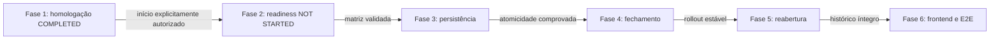

# ETP-014 — Plano de implementação

**Status:** `PLANNING — PHASE 1 COMPLETED; PHASE 2 NOT STARTED`

**Natureza:** plano documental; não autoriza implementação

Este plano traduz a [resolução homologada da BDP-014 v1](BDP-014_RESOLUTION_V1.md) em incrementos pequenos. O [contrato canônico](../architecture/PAYROLL_PERIOD_CLOSURE_CANONICAL_CONTRACT.md) e o [inventário legado](../architecture/PAYROLL_CLOSURE_LEGACY_INVENTORY.md) são referências obrigatórias. Alteração material exige nova decisão versionada antes de código.

## Princípios comuns

- uma única regra canônica, mesmo durante compatibilidade de rotas;
- empresa derivada do principal autenticado e recurso externo respondendo `404`;
- autorização por capability no controller e no serviço, deny-by-default;
- nenhuma associação automática de capability a papel;
- eventos, evidências e decisões append-only;
- estado, evento e `AuditLog` no mesmo `Prisma.TransactionClient`;
- nenhuma fórmula, alçada, tolerância ou integração não homologada;
- cada fase possui PR, validações e gate próprios.

## Fase 1 — Homologação e contrato canônico

**Status:** `COMPLETED` em 22/07/2026, exclusivamente documental.

### Objetivo

Homologar a BDP-014, consolidar o contrato canônico, inventariar os fluxos legados e definir a estratégia de compatibilidade sem alteração funcional.

### Pré-requisitos

- proposta BDP-014 revisada;
- decisões D-014-01 a D-014-10 explicitamente fornecidas para homologação.

### Entregas

- BDP-014 `APPROVED — VERSION 1`;
- contrato canônico e códigos de erro documentados;
- estados e eventos candidatos consolidados sem implementação;
- inventário dos dois fluxos, consumidores e divergências;
- estratégia e critérios de compatibilidade/descontinuação;
- capabilities e matriz de imutabilidade homologadas;
- plano de seis fases atualizado.

### Fora do escopo

Qualquer alteração funcional, migration, seed, endpoint ativo ou interface.

### Migrations e endpoints

- migrations: nenhuma;
- endpoints: apenas contratos documentados.

### Testes mínimos

Revisão de consistência documental, links e rastreabilidade decisão–contrato–fase.

### Aceite e gate

Resolução v1, contrato, inventário, roadmap e status mestre consistentes. Critério atendido; a Fase 2 está especificada, mas não foi iniciada por esta entrega.

### Riscos

Consumidores desconhecidos das rotas legadas e necessidade futura de validar o desenho físico em PostgreSQL/Prisma.

## Fase 2 — Domínio de prontidão somente leitura

**Status:** `NOT STARTED`.

### Objetivo

Calcular readiness determinística, separando blockers e warnings, sem fechar ou reabrir competência.

### Pré-requisitos

Fase 1 concluída; branch criada a partir de `develop`; contrato, execução elegível, vínculo com review, blockers e capabilities lidos da resolução v1.

### Entregas

- tipos compartilhados de readiness e códigos estáveis;
- política de domínio pura;
- query empresarial para competência, execução, ciclo, decisões, achados e mensagens;
- endpoint candidato `GET /payroll-periods/:id/closure-readiness` protegido;
- documentação e inventário de rota atualizados.

### Fora do escopo

Mutação, histórico novo, manifesto persistido e frontend funcional.

### Migrations esperadas

Nenhuma, salvo evidência técnica posterior de índice indispensável; nesse caso, a mudança exige revisão separada.

### Endpoints candidatos

Somente `GET /payroll-periods/:id/closure-readiness`; nenhum comando de fechamento ou reabertura.

### Testes mínimos

- matriz integral de blockers/warnings;
- execução ausente, antiga, posterior, falha e concorrente;
- review ausente, reaberto, não fechado ou com decisão invalidada;
- `401`, `403`, `404` empresarial e deny-by-default;
- nenhuma escrita em consultas.

### Aceite e gate

Readiness reproduz as decisões homologadas e é estável diante do mesmo snapshot. Divergência bloqueia a Fase 3.

### Riscos

Consultas extensas, N+1 e eventual incompatibilidade entre o modelo atual e a regra de execução canônica.

## Fase 3 — Persistência e auditoria

**Status:** `NOT STARTED — BLOCKED BY PHASE 2`.

### Objetivo

Representar versões operacionais, idempotência e manifesto/evidência sem ativar comando público de fechamento.

### Pré-requisitos

Modelo e retenção mínima aprovados; readiness validada; ADR aceita.

### Entregas candidatas

- evolução de `PayrollPeriodClosure` ou modelo substituto aprovado;
- referências a empresa, execução, ciclo, rodada e ator;
- estados anterior/posterior, trace e versão operacional;
- manifesto imutável e hash versionado;
- registro idempotente e versão otimista da competência;
- constraints, índices e porta de persistência transacional;
- writer conjunto com `AuditLog` desabilitado para exposição pública até a Fase 4.

### Fora do escopo

Endpoint mutável, frontend, integração externa e descarte automático.

### Migrations esperadas

Uma migration aditiva, com backfill seguro para eventos históricos e sem reescrita destrutiva. O número/nome será definido a partir da `develop` da fase.

### Endpoints candidatos

Nenhum endpoint mutável. O histórico poderá permanecer interno até sua autorização na Fase 4.

### Testes mínimos

- banco limpo e upgrade com closures existentes;
- constraints, unicidade, referências e hash determinístico;
- append-only e bloqueio de update/delete;
- atomicidade/rollback com `AuditLog`;
- idempotency key repetida e payload divergente;
- concorrência real em PostgreSQL.

### Aceite e gate

Migration reversível operacionalmente, histórico preservado e writer comprovadamente atômico. Falha bloqueia a Fase 4.

### Riscos

Backfill sem contexto completo, tamanho do manifesto e limites do lock via Prisma.

## Fase 4 — Fechamento operacional

**Status:** `NOT STARTED — BLOCKED BY PHASE 3`.

### Objetivo

Ativar o comando canônico de fechamento com revalidação, idempotência, concorrência, RBAC e auditoria.

### Pré-requisitos

Fases 1 a 3 aceitas; capabilities cadastradas sem assignments automáticos; plano de compatibilidade aprovado.

### Entregas

- comando candidato `POST /payroll-periods/:id/close`;
- capability `payroll.period.close.execute`;
- lock, versão otimista e revalidação dentro da transação;
- manifesto, evento e `AuditLog` atômicos;
- bloqueio dos comandos homologados para competência fechada;
- adaptação das escritas legadas para delegação canônica;
- telemetria mínima de conflito e replay sem dados sensíveis.

### Fora do escopo

Reabertura, frontend, notificação, integração externa e alçada financeira.

### Migrations esperadas

Nenhuma além da Fase 3, salvo constraint comprovadamente ausente e revisada.

### Endpoints candidatos

`POST /payroll-periods/:id/close`; adaptadores legados poderão delegar ao mesmo caso de uso sem contrato alternativo.

### Testes mínimos

- todos os blockers e warnings reconhecidos;
- replay idêntico, chave divergente e duplo comando concorrente;
- execução/ciclo obsoletos entre readiness e commit;
- `401`, `403`, `404`, `409`, isolamento e grants;
- rollback de estado, evento, manifesto e auditoria;
- regressão das duas rotas temporariamente compatíveis.

### Aceite e gate

Somente uma transição efetiva por versão; nenhuma rota contorna a política. Estabilização e decisão de rollout liberam a Fase 5.

### Riscos

Bypass por outro módulo, deadlock, timeout e consumidor legado com contrato diferente.

## Fase 5 — Reabertura controlada

**Status:** `NOT STARTED — BLOCKED BY PHASE 4`.

### Objetivo

Reabrir a competência preservando a evidência anterior e exigindo novo ciclo operacional para fechamento posterior.

### Pré-requisitos

Efeitos, segregação e tratamento de integrações homologados; fechamento estabilizado.

### Entregas

- comando candidato `POST /payroll-periods/:id/reopen`;
- capability `payroll.period.close.reopen`;
- justificativa, idempotência e concorrência;
- evento que supera a versão fechada sem alterá-la;
- liberação das operações aprovadas;
- regra que exige nova execução e novo review para novo fechamento;
- integração explícita, mas não automática, com `payroll.review.reopen` quando requerida pelo usuário.

### Fora do escopo

Reversão automática de exportações, integrações, pagamentos ou notificações.

### Migrations esperadas

Nenhuma se a versão operacional da Fase 3 suportar a transição; qualquer lacuna exige revisão do modelo antes do código.

### Endpoints candidatos

`POST /payroll-periods/:id/reopen`; a reabertura de review continua no contrato independente da ETP-013.

### Testes mínimos

- somente `CLOSED -> OPEN`, motivo obrigatório e capability;
- reabertura concorrente/repetida;
- preservação do manifesto e decisões anteriores;
- ausência de reabertura automática do review;
- nova execução/review obrigatórios para reclose;
- grants, isolamento, auditoria e rollback.

### Aceite e gate

Histórico anterior permanece íntegro e nenhum novo fechamento reutiliza evidência superada. Só então a Fase 6 é liberada.

### Riscos

Interpretação incorreta de que review histórico foi invalidado e existência de integração irreversível não inventariada.

## Fase 6 — Frontend e validação ponta a ponta

**Status:** `NOT STARTED — BLOCKED BY PHASE 5`.

### Objetivo

Disponibilizar prontidão, fechamento, reabertura e histórico com proteção visual e contratos tipados.

### Pré-requisitos

APIs estabilizadas, capabilities cadastradas e fluxo operacional homologado em ambiente de validação.

### Entregas

- evolução da área `/folha/fechamentos`;
- checklist de blockers/warnings e reconhecimento explícito;
- confirmação de fechamento/reabertura e motivo;
- reaproveitamento da idempotency key em duplo clique/retry;
- timeline com execução, ciclo, rodada, atores e evidências permitidas;
- links para execução e conferência;
- estados de loading e tratamento de `400`, `401`, `403`, `404`, `409` e `500`.

### Fora do escopo

Dashboard, scheduler, notificações, integrações externas e consulta administrativa geral de auditoria.

### Migrations esperadas

Nenhuma.

### Endpoints candidatos

Os quatro contratos canônicos homologados: readiness, close, reopen e history.

### Testes mínimos

- componentes, rotas protegidas e ações por capability;
- warnings, blockers, confirmação, motivo e duplo clique;
- erros HTTP e sessão/empresa ativa;
- E2E com duas empresas, fechamento, reabertura e novo fechamento;
- acessibilidade e regressão da ETP-013.

### Aceite e encerramento

Critérios globais da especificação atendidos, cobertura sem regressão, documentação operacional e inventário de rotas atualizados. Somente então a ETP-014 poderá ser candidata a `COMPLETED`.

### Riscos

Exposição visual excessiva de evidências, estado desatualizado e bundle adicional.

## Matriz de bloqueio entre fases

Nenhuma fase pode antecipar regra, migration ou contrato pertencente ao gate seguinte.

## Validações esperadas nas fases técnicas futuras

- `pnpm check`, lint, typecheck, testes, cobertura e build;
- `prisma generate` e `prisma validate`;
- migration em banco limpo e upgrade representativo quando houver schema;
- seed sem atribuição automática a papéis;
- Prettier e `git diff --check`;
- testes de PostgreSQL para lock, concorrência e rollback;
- inventário de rotas e documentação atualizados em cada incremento.
