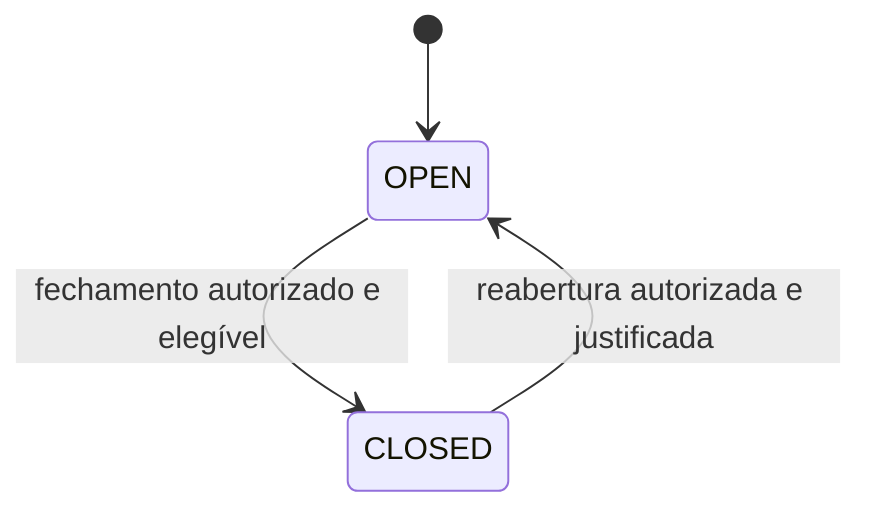
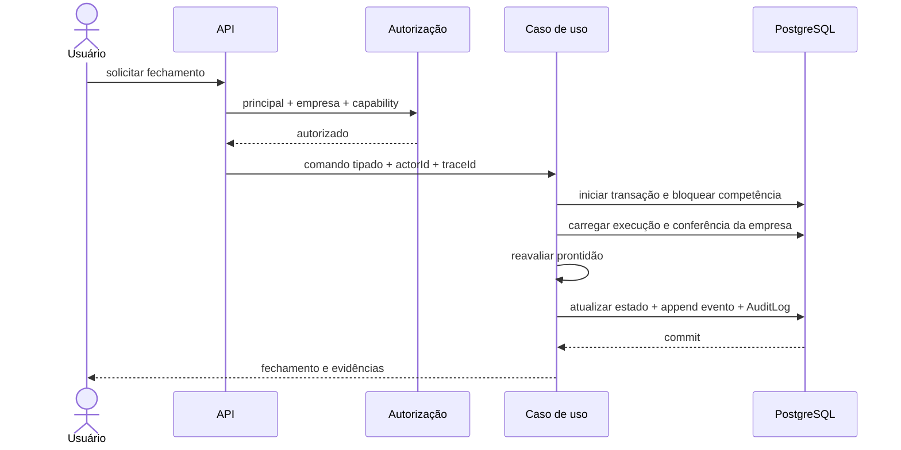
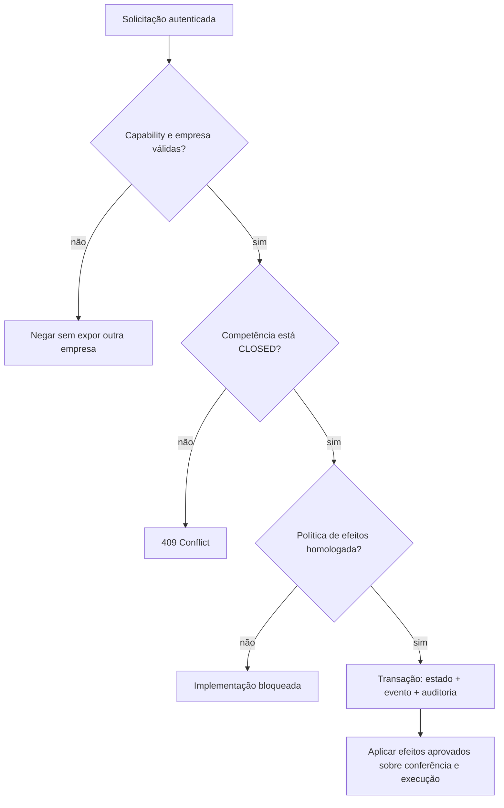

# ETP-014 — Fechamento de Competência e Integração Operacional

**Status:** `IN PROGRESS`

**Natureza:** especificação vinculante e registro incremental da implementação

**Dependência concluída:** ETP-013 — `COMPLETED — VERSION 1`

**Decisão homologada:** [BDP-014 — Resolução v1](BDP-014_RESOLUTION_V1.md)

**Próximo gate:** revisão e merge da Fase 4 operacional do [plano](ETP-014_IMPLEMENTATION_PLAN.md)

## 1. Objetivo

A ETP-014 deverá transformar o fechamento técnico já existente em um encerramento operacional coerente com a conferência da folha. O objetivo é garantir que uma competência somente seja fechada a partir de uma execução identificável, conferida e encerrada, preservando isolamento empresarial, autorização explícita, rastreabilidade e histórico imutável.

### Escopo funcional proposto

- apresentar a prontidão de uma competência para fechamento e os impedimentos objetivos;
- vincular o fechamento da competência à execução e ao ciclo de conferência que o fundamentam;
- fechar a competência de forma atômica e idempotente;
- impedir mutações incompatíveis enquanto a competência estiver fechada;
- permitir reabertura controlada, justificada e auditada, conforme política ainda a homologar;
- disponibilizar estado, evidências e histórico operacional do fechamento;
- consolidar uma única porta de entrada para fechamento e reabertura, preservando compatibilidade durante a transição;
- expor a operação no frontend somente após a fundação de domínio, persistência e autorização estar validada.

### Problemas que resolverá

- o fechamento de `PayrollPeriod` ainda não exige um `PayrollReviewCycle` encerrado;
- existem duas superfícies de API e dois serviços que alteram o mesmo estado de competência com validações distintas;
- `PayrollPeriodClosure` registra eventos, mas não identifica ator, empresa, correlação, execução ou ciclo de conferência de forma completa;
- as rotas legadas de competência/fechamento ainda não integram a fundação autenticada e deny-by-default;
- a reabertura de competência ainda não possui efeito homologado sobre conferência, decisões e execuções posteriores.

### Resultados esperados

- uma fonte canônica para decidir e executar o fechamento;
- pré-condições explícitas e testáveis;
- vínculo rastreável entre competência, execução, conferência e evento operacional;
- mutação de estado, evento append-only e `AuditLog` na mesma transação;
- resposta segura para recursos de outra empresa e autorização por capability;
- interface operacional orientada pelos contratos do backend;
- documentação e testes suficientes para retirar com segurança as superfícies redundantes.

## 2. Fora do escopo

- fórmulas, alíquotas, incidências, arredondamentos ou interpretação legal da folha;
- homologação das regras de remuneração variável da BDP-006;
- pagamentos, remessas bancárias, contabilização, eSocial ou integrações de fornecedores;
- notificações, filas, scheduler, fechamento automático ou escalonamento por prazo;
- alçadas financeiras e novos níveis de aprovação da conferência;
- alteração do workflow de duas aprovações da ETP-013;
- relatórios gerenciais, dashboards e inteligência operacional;
- política definitiva de retenção, descarte ou exportação de auditoria da BDP-011;
- refresh token, logout de backend ou nova estratégia de autenticação;
- hardening, observabilidade ampla e otimizações de performance não indispensáveis ao fluxo;
- encerramento de exercício, obrigações acessórias ou fechamento contábil.

Esses itens permanecem candidatos às ETP-015 a ETP-017 ou a iniciativas futuras formalmente especificadas.

## 3. Base reutilizável

| Capacidade existente                        | Reutilização prevista                                         | Lacuna para a ETP-014                                          |
| ------------------------------------------- | ------------------------------------------------------------- | -------------------------------------------------------------- |
| `PayrollPeriod`                             | agregado da competência e estado `OPEN`/`CLOSED`              | estados são `String` e há duas rotas de mutação                |
| `PayrollRun` e mensagens                    | execução concluída, versões e erros bloqueantes               | definir qual execução é a evidência canônica                   |
| `PayrollPeriodClosure`                      | histórico append-only `CLOSED`/`REOPENED`                     | faltam contexto empresarial, ator, trace e vínculos explícitos |
| `PayrollReviewCycle`                        | conferência encerrada por execução e empresa                  | definir elegibilidade e reação à reabertura da competência     |
| eventos, decisões e invalidações da ETP-013 | trilha imutável e reabertura controlada                       | não duplicar esse histórico no fechamento operacional          |
| JWT e principal tipado                      | `actorId`, empresa ativa e `traceId`                          | migrar as rotas legadas para a fundação autenticada            |
| RBAC por capability                         | autorização deny-by-default e grants temporários/emergenciais | homologar capabilities próprias da competência                 |
| `AuditLog` transacional                     | auditoria com estados anterior/posterior                      | integrar toda decisão de fechamento na mesma transação         |
| frontend de folha e conferência             | sessão, empresa ativa, cliente tipado, guards e erros HTTP    | criar experiência de prontidão/fechamento após os contratos    |

## 4. Casos de uso

### UC-014-01 — Consultar prontidão

O usuário autenticado consulta uma competência da empresa ativa. O sistema retorna seu estado e uma lista estruturada de critérios atendidos ou bloqueios, sem alterar dados. A resposta não deve revelar a existência de recursos de outra empresa.

### UC-014-02 — Fechar competência

O usuário solicita o fechamento com o contrato de motivo definido pela decisão de negócio. O sistema autoriza a capability, bloqueia concorrência, reavalia as pré-condições e, em uma transação, altera a competência, acrescenta o evento operacional e grava o `AuditLog`.

### UC-014-03 — Consultar histórico

O usuário autorizado consulta a linha do tempo com fechamentos e reaberturas, execução e conferência relacionadas, ator, data, motivo e correlation/trace ID, limitada à empresa ativa.

### UC-014-04 — Reabrir competência

O usuário solicita reabertura com justificativa. A operação somente será implementada após homologação de seus efeitos sobre o ciclo de conferência, decisões anteriores, execução de folha e novos insumos. Estado, evento e auditoria devem ser atômicos e append-only.

### UC-014-05 — Tratar repetição ou concorrência

Solicitações simultâneas ou repetidas não podem criar estados contraditórios nem múltiplos eventos efetivos para a mesma transição. A política de idempotência e a chave do comando precisam ser aprovadas antes da API final.

### UC-014-06 — Preservar imutabilidade

Enquanto a competência estiver `CLOSED`, comandos que alterem seus insumos, execução ou conferência devem ser recusados. O inventário definitivo desses comandos integra o gate da implementação.

## 5. Modelo de domínio proposto

### Agregados e relacionamentos

- **`PayrollPeriod` (existente):** raiz da competência operacional; detém estado atual e timestamps.
- **`PayrollRun` (existente):** execução técnica candidata a fundamentar o fechamento; pertence à competência e empresa por relacionamento.
- **`PayrollReviewCycle` (existente):** conferência de uma execução; deve estar `CLOSED` para ser candidata ao fechamento operacional.
- **`PayrollPeriodClosure` (existente):** evento append-only de fechamento/reabertura. Recomenda-se evoluí-lo em vez de criar um segundo histórico.
- **`AuditLog` (existente):** evidência transversal da decisão, gravada na mesma transação.

Não foi identificada necessidade comprovada de um novo agregado nesta fase. A eventual evolução de `PayrollPeriodClosure` é candidata a incluir `companyId`, `payrollRunId`, `payrollReviewCycleId`, `actorId`, `traceId`, estados anterior/posterior e metadados de idempotência. Campos, nulabilidade e retrocompatibilidade dependem das decisões D-014-01 a D-014-06; portanto, nenhuma migration está autorizada por esta especificação.

### Responsabilidades

- um serviço de aplicação canônico deverá orquestrar autorização, isolamento, prontidão e transação;
- políticas de domínio puras deverão avaliar transições e bloqueios sem acessar infraestrutura;
- repositórios deverão carregar todos os recursos já filtrados por empresa;
- o writer de auditoria deverá usar o cliente transacional recebido;
- controllers apenas validarão contratos, extrairão o principal e delegarão o caso de uso.

## 6. Regras de negócio candidatas

### Estados e transições

Esta etapa reutiliza os estados atuais da competência e não cria estados por documentação.

Transições repetidas ou diferentes dessas devem resultar em conflito. A eventual necessidade de estados intermediários deve ser objeto de nova decisão e migration própria.

### Pré-condições mínimas propostas para fechamento

- identidade válida, empresa ativa e capability homologada;
- competência `OPEN` pertencente à empresa ativa;
- execução elegível em estado `COMPLETED` e sem mensagem bloqueante;
- ciclo de conferência da mesma empresa e execução em estado `CLOSED`;
- inexistência de alteração posterior que torne a evidência obsoleta;
- operação concorrente serializada e pré-condições reavaliadas dentro da transação;
- persistência conjunta de estado, evento e auditoria.

A definição de “execução elegível” e “alteração posterior” é decisão humana pendente. A lista acima não autoriza algoritmo de seleção automática.

### Restrições técnicas

- eventos anteriores nunca serão atualizados ou apagados;
- a empresa não será aceita do corpo da requisição como fonte de autorização;
- recurso de outra empresa seguirá a política v1 de `404` da BDP-009;
- ausência de capability resulta em `403` e ausência de autenticação em `401`;
- frontend não concede autorização; apenas reflete as capabilities retornadas;
- nenhuma capability será associada automaticamente a papel;
- fechamento e reabertura não poderão contornar o workflow da ETP-013;
- motivo deverá ser preservado integralmente na trilha quando exigido pela decisão aprovada.

### Permissões candidatas

Recomenda-se, de forma não vinculante, capabilities específicas como `payroll.period.view`, `payroll.period.close` e `payroll.period.reopen`. Reutilizar `payroll.review.close` ou `payroll.review.reopen` misturaria responsabilidades. Nomes, granularidade e concessões dependem de homologação; o comportamento continuará deny-by-default.

## 7. Fluxos operacionais

### Fechamento

Fluxo textual: consultar prontidão; selecionar explicitamente a evidência quando a política assim exigir; confirmar a ação; revalidar tudo no backend; fechar atomicamente; devolver a representação atual e o identificador de correlação.

### Reabertura

## 8. Impactos técnicos

### Backend

- escolher um serviço e contrato canônicos entre `payroll-periods` e `payroll-closures`;
- introduzir política pura de prontidão e comandos transacionais;
- aplicar JWT, empresa ativa, capability e `404` empresarial;
- inventariar e bloquear mutações incompatíveis com competência fechada;
- manter compatibilidade ou descontinuar rotas duplicadas segundo plano aprovado;
- devolver erros estruturados `400`, `401`, `403`, `404`, `409` e `500`.

Contratos candidatos, sem autorização de endpoint: consulta de prontidão, fechamento, reabertura e histórico sob o recurso `payroll-periods/:id`. A rota definitiva e a estratégia de compatibilidade são a decisão D-014-01.

### Frontend

- evoluir `/folha/fechamentos` para exibir prontidão, bloqueios e histórico;
- ligar a navegação às execuções e conferências existentes;
- mostrar ações apenas com capabilities correspondentes, mantendo o backend como autoridade;
- exigir confirmação e motivo conforme contrato homologado;
- tratar concorrência, conflito, sessão expirada e recurso empresarial invisível;
- preservar acessibilidade, feedback de carregamento e prevenção de duplo envio.

### Banco de dados

- preferir a evolução de `PayrollPeriodClosure` e seus relacionamentos;
- avaliar enum/check constraint para estado e ação sem quebrar dados existentes;
- definir unicidade/idempotência e estratégia de lock;
- criar migration somente após aprovação dos campos e análise de retrocompatibilidade;
- manter históricos existentes e nunca reescrevê-los.

### Auditoria e RBAC

- registrar `actorId`, `companyId`, `traceId`, motivo, estado anterior/posterior e referências à execução/conferência;
- usar o writer transacional existente;
- não conceder capabilities por seed a papéis de negócio sem decisão expressa;
- reutilizar substituição temporária e acesso emergencial da BDP-009, respeitando expiração e auditoria.

### Integrações

Nenhuma integração externa integra a ETP-014. O fechamento poderá emitir um contrato interno estável para consumidores futuros, mas publicação assíncrona, outbox, notificações e fornecedores pertencem à ETP-015 e exigem especificação própria.

## 9. Estratégia incremental de implementação

### Fase 1 — Homologação e contrato canônico — `COMPLETED`

- D-014-01 a D-014-10 resolvidas na BDP-014 v1;
- matriz de capabilities e mutações bloqueadas homologada;
- contrato canônico e compatibilidade legada documentados, sem modelo físico implementado.

**Aceite:** resolução, contrato, inventário e plano publicados; a ETP-014 permanece `PLANNING`.

### Fase 2 — Domínio e prontidão somente leitura — `COMPLETED`

- criar políticas puras e contratos de prontidão;
- consolidar leitura empresarial sem mutar estado;
- cobrir seleção de evidências, bloqueios e concorrência conceitual.

**Aceite:** testes unitários de todas as combinações aprovadas e integração multiempresa/deny-by-default.

### Fase 3 — Persistência e auditoria

- executar a migration aprovada, se necessária;
- implementar repositório e trilha append-only;
- validar migration em banco limpo e upgrade com histórico existente.

**Aceite:** constraints, rollback transacional, integridade referencial e imutabilidade testados.

### Fase 4 — Fechamento operacional

- implementar o comando canônico de fechamento;
- aplicar capability, isolamento, lock/idempotência e auditoria atômica;
- definir compatibilidade ou desativação segura das rotas redundantes.

**Aceite:** fluxos válidos, todas as recusas, concorrência, rollback, auditoria e `404` empresarial cobertos.

### Fase 5 — Reabertura controlada

- implementar somente os efeitos homologados;
- preservar e relacionar decisões/eventos anteriores;
- impedir novos estados incoerentes.

**Aceite:** justificativa, autorização, efeitos sobre conferência/execução, idempotência e histórico validados.

### Fase 6 — Interface e validação ponta a ponta

- implementar prontidão, ações, confirmação e timeline;
- cobrir capabilities, erros HTTP, acessibilidade e duplo envio;
- atualizar documentação operacional e inventário de rotas.

**Aceite:** testes frontend, API e E2E dos fluxos aprovados, sem regressão das ETP-010 a ETP-013.

## 10. Estratégia de testes

- **Domínio:** estados, transições, matriz de prontidão, evidência obsoleta e invariantes append-only.
- **Aplicação:** autorização, isolamento, seleção aprovada da execução/ciclo, idempotência e conflitos.
- **Persistência:** constraints, relações, locks, histórico legado, rollback e migration de ida.
- **API:** contratos e códigos `400`, `401`, `403`, `404`, `409`, correlation ID e deny-by-default.
- **Auditoria:** uma evidência completa por decisão na mesma transação; nenhuma evidência em rollback.
- **Frontend:** guards, ações por capability, bloqueios, confirmação, timeline e tratamento de erros.
- **E2E:** fechamento a partir de conferência `CLOSED`, reabertura conforme política e isolamento entre duas empresas.
- **Regressão:** execução, conferência, achados, aprovações, fechamento/reabertura do review e rotas mantidas durante compatibilidade.

## 11. Decisões homologadas para a versão 1

| ID       | Decisão homologada                                                             | Responsáveis de referência    | Aplicação              |
| -------- | ------------------------------------------------------------------------------ | ----------------------------- | ---------------------- |
| D-014-01 | Competência é canônica; `/payroll-closures` é compatibilidade temporária       | Produto e Arquitetura         | backend                |
| D-014-02 | Execução explícita, `COMPLETED`, de maior sequência válida e não invalidada    | DP e Produto                  | domínio/API            |
| D-014-03 | Review `CLOSED` correspondente, vigente e sem decisão inválida não substituída | DP e Produto                  | domínio                |
| D-014-04 | Blockers e warnings da v1 seguem o catálogo da resolução                       | DP, Financeiro e Produto      | prontidão              |
| D-014-05 | Reabertura independente, nova versão e novo ciclo completo para reclose        | DP, Financeiro e Segurança    | reabertura             |
| D-014-06 | Chave obrigatória, lock, versão otimista, constraints e transação atômica      | Produto e Arquitetura         | contratos/persistência |
| D-014-07 | Cinco capabilities empresariais, deny-by-default e sem assignment automático   | Segurança, DP e Diretoria     | RBAC                   |
| D-014-08 | Competência fechada é imutável conforme inventário homologado                  | DP e responsáveis dos módulos | integração interna     |
| D-014-09 | Manifesto mínimo imutável; retenção temporal continua na BDP-011               | Jurídico/DPO, Segurança e DP  | auditoria              |
| D-014-10 | Remuneração variável pendente é warning com reconhecimento, sem alçada         | DP e Financeiro               | integração ETP-012     |

As escolhas finais e suas regras vinculantes estão na [resolução v1](BDP-014_RESOLUTION_V1.md); a [proposta](BDP-014_RESOLUTION_PROPOSAL.md) preserva as alternativas rejeitadas. A homologação não inicia automaticamente as fases técnicas.

## 12. Riscos e dependências

| Risco                                                 | Impacto                                         | Mitigação proposta                                 |
| ----------------------------------------------------- | ----------------------------------------------- | -------------------------------------------------- |
| duas implementações atuais fecham a mesma competência | regras divergentes e bypass de segurança        | escolher contrato canônico antes de alterar código |
| vínculo implícito com “última execução”               | fechamento baseado em resultado obsoleto        | decisão explícita e referência persistida          |
| concorrência entre execução, review e fechamento      | estado fechado com evidência inválida           | lock, revalidação e transação única                |
| reabertura sem efeitos definidos                      | aprovações ou cálculos incoerentes              | bloquear implementação até D-014-05                |
| rotas legadas sem fundação RBAC                       | acesso indevido entre empresas                  | migração inventariada e deny-by-default            |
| histórico atual com contexto incompleto               | auditoria insuficiente                          | evolução compatível, sem reescrever eventos        |
| BDP-006 pendente                                      | bloqueio de remuneração variável não homologado | resolver apenas D-014-10, sem criar fórmula        |
| BDP-011 pendente                                      | retenção de auditoria indefinida                | preservar dados e adiar descarte automático        |
| escopo expandir para integrações externas             | atraso e acoplamento                            | manter ETP-015 explicitamente fora do escopo       |

### Estimativa de complexidade

**Alta.** A maior complexidade não está na troca de estado, mas na consolidação segura das rotas existentes, na atomicidade entre competência e evidências da ETP-013, na concorrência e na definição dos efeitos da reabertura. A execução deve permanecer fracionada nas seis fases acima; estimativas de prazo dependem da homologação das decisões.

## 13. Critérios globais de aceite

- todas as decisões bloqueantes estão formalmente homologadas e rastreáveis;
- existe uma única regra canônica de fechamento, ainda que haja compatibilidade temporária de rota;
- somente uma execução/conferência elegível e da empresa ativa fundamenta o fechamento;
- estado, evento e auditoria são atômicos, imutáveis e correlacionáveis;
- concorrência e repetição não produzem duplicidade efetiva;
- competência fechada bloqueia exatamente as operações homologadas;
- reabertura produz somente os efeitos aprovados e preserva o histórico;
- autorização é por capability, deny-by-default e sem nomes fixos de papéis;
- backend, frontend, migration e E2E passam pelas validações do monorepo;
- roadmap, status mestre, inventário de rotas e documentação operacional refletem a entrega real.

## 14. Estado desta especificação

A ETP-014 está `IN PROGRESS`. BDP-014 está `APPROVED — VERSION 1`, as Fases 1 a 3 estão
`COMPLETED` e a Fase 4 está `READY FOR REVIEW`. Readiness, persistência e o
[fechamento operacional](../modules/PAYROLL_PERIOD_OPERATIONAL_CLOSURE.md) usam o contrato canônico.
Não há reabertura, frontend, histórico público separado ou adaptação das demais rotas legadas nesta
fase. A Fase 5 permanece `NOT STARTED`.
