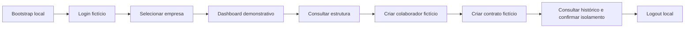

# MVP-001 — Escopo do protótipo executivo local

## Objetivo

Disponibilizar uma demonstração local, reproduzível e segura do DP-System para gestores, usando
somente dados fictícios e funcionalidades reais. O protótipo não é uma implantação produtiva.

## MUST HAVE

- start local e reset demonstrativo documentados e repetíveis;
- identidade demonstrativa, vínculo empresarial e grants explícitos, sem dados ou segredos reais;
- login, seleção de empresa e logout local claramente identificado;
- shell responsivo e dashboard explicitamente demonstrativo;
- massa fictícia coerente para duas empresas, permitindo demonstrar isolamento;
- um fluxo completo já existente: estrutura organizacional → colaborador → contrato;
- feedback de sucesso/erro suficiente para o roteiro;
- roteiro de 15 minutos e checklist de smoke test;
- lint, typecheck, testes e build aprovados.

## SHOULD HAVE

- fluxo de admissão usando colaborador/contrato fictício;
- visão controlada de auditoria já persistida, se puder ser exposta sem ampliar autorização;
- indicadores do dashboard derivados da massa demo, identificados como demonstrativos;
- comando único de bootstrap e reset com proteção explícita de ambiente local.

## COULD HAVE

- conferência ou histórico de fechamento usando fixtures controladas;
- segunda persona demonstrativa com capabilities distintas;
- roteiro alternativo para férias/afastamentos.

## OUT OF SCOPE

- produção, cloud, VPS, CI/CD produtivo, Kubernetes e observabilidade produtiva;
- ETP-015.4, migração ampla das APIs legadas ou relaxamento de segurança;
- integrações externas, notificações, scheduler e dados pessoais reais;
- desligamentos, que hoje são placeholder;
- folha legal, fórmulas, alíquotas ou políticas não homologadas;
- telas cenográficas não declaradas, mudanças em migrations já mescladas e refatoração ampla.

## Fluxo de demonstração proposto

O fluxo reaproveita APIs e telas existentes. A implementação futura deve provar cada transição com
teste e smoke test; até lá, o MVP permanece `PLANNED`.
