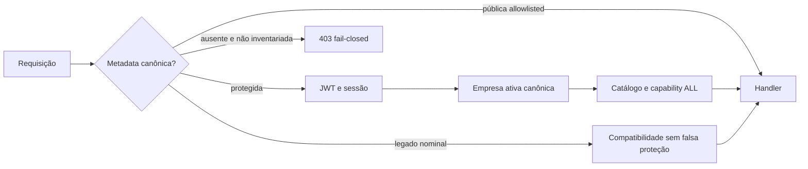

# ETP-015.4 — Guards e decorators canônicos de autorização

## Estado e limites

**Estado:** `IMPLEMENTED — AUTHORIZATION PRIMITIVES AVAILABLE`

**Escopo:** infraestrutura transversal e classificação de rotas canônicas existentes

**Fora do escopo:** isolamento de queries da ETP-015.5, masking, auditoria de negócio, migração de
famílias legadas, grants demo, schema, seed e frontend

## Metadata

`ROUTE_ACCESS_POLICY` contém um objeto imutável com classificação, exigência de empresa ativa,
capabilities e semântica `ALL`. Os decorators canônicos são:

- `@PublicRoute()` — somente para handler presente na allowlist nominal;
- `@AuthenticatedRoute()` — exige principal válido;
- `@RequireActiveCompany()` — exige principal e contexto empresarial resolvido;
- `@RequireCapabilities(...codes)` — exige principal, empresa ativa e todas as capabilities.

Não existe semântica `ANY` homologada. O código não infere capability por papel, e-mail, empresa,
controller, prefixo, frontend ou modo demo.

## Ordem de execução

`AuthorizationRouteGuard` é global. A compatibilidade não usa wildcard: somente os 129 pares
`Controller#handler` congelados na baseline são aceitos sem metadata. Assim, um novo handler não
classificado é bloqueado antes do caso de uso, mesmo dentro de controller legado.

## Identidade, empresa e capability

- `JwtAuthGuard` preserva os códigos de token expirado/inválido, usuário ausente/inativo e sessão
  ausente/expirada/revogada como `401`;
- `ActiveCompanyGuard` rejeita ausência de empresa ativa e delega toda validação de vínculo,
  vigência, empresa e spoofing ao `ActiveCompanyResolverService` da ETP-015.2;
- `CapabilitiesGuard` confirma que cada código está ativo no catálogo, possui escopo `COMPANY` e
  integra as permissions efetivas do principal; ausência, revogação, futuro ou expiração não entram
  no principal e resultam em `403`;
- capability desconhecida ou de escopo incompatível é erro de configuração sanitizado e fail-closed.

Não há cache nesta entrega. A consulta ao catálogo por requisição prioriza revogação imediata e evita
chave incompleta entre usuário, sessão e empresa; otimização futura exige evidência e política de
invalidação.

## OpenAPI e erros

Os decorators registram bearer auth, `401`, `403` e extensões não sensíveis:
`x-access-classification`, `x-active-company-required`, `x-required-capabilities` e
`x-capability-semantics`. Não são expostos grants, assignments, papéis nem metadata de catálogo.

O filtro global mantém o envelope existente. Diagnósticos de rota sem política registram apenas o
identificador técnico do handler e a classificação; token, cookie, authorization, body e dados
pessoais não são logados.

## Verificador

`RouteClassificationVerifierService` usa discovery e metadata reais do NestJS. O teste de
reconciliação falha quando:

- surge handler sem política e sem entrada legada aprovada;
- uma rota pública não pertence à allowlist;
- metadata é inválida ou conflitante;
- uma entrada do manifesto legado fica órfã;
- capability não exige empresa ativa ou está vazia.

O verificador é executado pela suíte Jest incluída em `pnpm check` e informa módulo, controller,
handler, verbo, rota, falha e ação corretiva.

## Limitações

Os 129 handlers `LEGACY_DEFERRED` mantêm exatamente o comportamento anterior e não estão declarados
seguros. ETP-015.5 deve introduzir isolamento antes de lookup por família. As etapas 015.6–015.10
permanecem não iniciadas.
