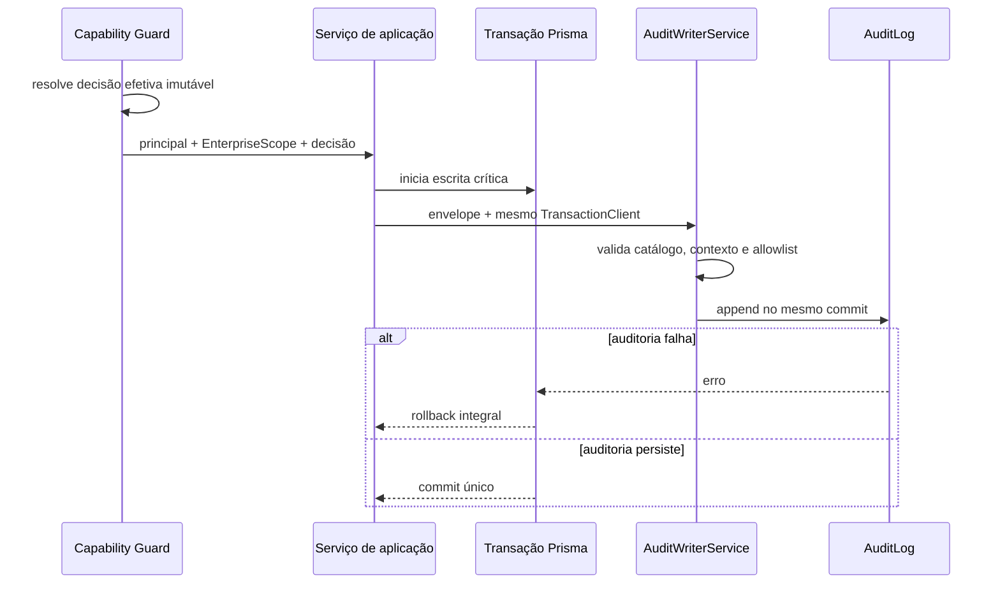

# ETP-015.7 — Authorization Audit Events

**Status:** `IMPLEMENTED — AUTHORIZATION AUDIT FOUNDATION AVAILABLE`

## Objetivo e recorte

Este incremento estabelece uma trilha canônica para decisões de autorização e escritas críticas já
existentes. Ele reutiliza `AuditLog`, `AuditWriterService`, o principal autenticado e
`EnterpriseScope`; não cria migration, capability, rota, DTO, seed ou interface.

Estão cobertos os produtores canônicos de autenticação, assignments, grants temporários e
emergenciais, payroll review e fechamento/reabertura de competência. As 129 rotas
`LEGACY_DEFERRED` continuam fora do recorte. Nenhuma leitura sensível foi ativada: a classificação
existente é técnica, mas BDP-001 e BDP-011 ainda não homologam projeção, masking, retenção ou
materialidade por campo. Essa cobertura pertence à ETP-015.6.

## Fluxo canônico

## Contratos técnicos

- `AUDIT_EVENT_CATALOG` é a fonte fechada de códigos, versão, categoria, atomicidade, contexto
  empresarial, capabilities e chaves extras de metadata.
- `AuditEventEnvelope` transporta principal, escopo, decisão efetiva, recurso, estado mínimo,
  código de motivo, timestamp e metadata explicitamente autorizada.
- `EffectiveAuthorizationContext` é imutável e contém empresa, resultado, capabilities requeridas e
  satisfeitas e IDs dos grants efetivamente usados. Sua resolução usa o principal já carregado e
  nunca consulta novamente assignments ou grants.
- `AuditWriterService` é o único adapter autorizado a chamar `auditLog.create`.
- Eventos críticos exigem um `Prisma.TransactionClient` explícito; ausência do client falha
  fechada antes da persistência.
- `AuthorizationAuditVerifierService` usa AST e manifesto explícito para rejeitar escrita direta,
  update/delete, código dinâmico desconhecido, metadata indireta e evento crítico fora da
  transação.

## Invariantes

1. Evento antigo não é atualizado ou removido pela aplicação.
2. Escrita crítica e auditoria confirmam ou revertem juntas.
3. Empresa de eventos empresariais é validada contra o principal e, nos produtores de
   autorização, deriva de `EnterpriseScope`.
4. `actorId`, `sessionId` e `traceId` derivam do principal autenticado.
5. Capability e grant derivam da decisão efetiva, sem nova consulta no writer.
6. Estado anterior/posterior é mínimo; snapshots integrais de assignments e grants não são
   persistidos.
7. Metadata fora da allowlist não é redigida: é recusada.
8. Falhas `401`, `403` e `404` não geram `AuditLog` de alta cardinalidade; permanecem em logs
   técnicos sanitizados.
9. Consulta cross-tenant preserva `404` uniforme e não registra identificador estrangeiro.
10. Retry e idempotência dos fluxos de folha permanecem regidos pelos agregados existentes; a
    auditoria não cria uma segunda decisão de negócio.

## Atomicidade por classe

| Classe                             | Comportamento                                                            |
| ---------------------------------- | ------------------------------------------------------------------------ |
| Assignments                        | evento obrigatório na mesma transação serializável                       |
| Grants temporários/emergenciais    | evento obrigatório no mesmo commit da criação, revogação ou expiração    |
| Payroll review                     | `PayrollReviewEvent` e `AuditLog` continuam no mesmo commit da transição |
| Fechamento/reabertura              | manifesto, histórico, estado e `AuditLog` continuam no mesmo commit      |
| Login, seleção de empresa e logout | eventos informativos; não são acoplados a uma escrita crítica de domínio |

## Compatibilidade e limites

- Os códigos já emitidos foram preservados; não há reescrita de histórico.
- A coluna `action` de 50 caracteres e os índices existentes comportam o catálogo v1.
- O append-only é garantido pela API e pelo verificador, não por trigger no banco. Hardening por
  privilégio ou trigger é risco futuro e exige migration própria aprovada.
- `reason` de negócio permanece no campo dedicado de `AuditLog`; metadata recebe apenas códigos e
  dados estruturados allowlisted.
- Assignments globais não possuem capability empresarial aprovada; continuam serviços internos,
  sem controller público, e registram contexto do operador sem inventar nova capability.
- A ETP-015.6 é o próximo incremento autorizado e deverá reutilizar estes contratos para qualquer
  leitura sensível homologada.

## Referências

- [Catálogo de eventos](ETP-015_7_AUDIT_EVENT_CATALOG.md)
- [Inventário de cobertura](ETP-015_7_AUDIT_COVERAGE_INVENTORY.md)
- [Allowlist de metadata](ETP-015_7_METADATA_ALLOWLIST.md)
- [Matriz negativa](ETP-015_7_NEGATIVE_TEST_MATRIX.md)
- [Rollout e rollback](ETP-015_7_ROLLOUT_AND_ROLLBACK.md)
- [Evidências de aceite](ETP-015_7_ACCEPTANCE_EVIDENCE.md)
