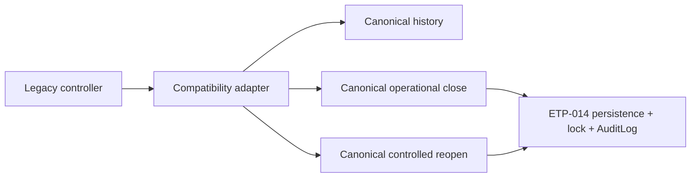

# ETP-015.8 — Payroll Closure P0 Migration

**Status:** `IMPLEMENTED IN PR — GATE C HUMAN APPROVAL PENDING`

## Objetivo e limites

Os quatro aliases `/payroll-closures` permanecem disponíveis como adapters temporários e
deprecated. Eles não possuem regra de fechamento: delegam exclusivamente a
`PayrollPeriodHistoryService`, `PayrollPeriodOperationalClosureService` e
`PayrollPeriodControlledReopeningService`. `PayrollPeriod` continua sendo o agregado canônico.

Este incremento não remove aliases, não inicia ETP-015.9/015.10 e não autoriza produção, cloud ou
deploy. Não há alteração de Prisma, migration, seed, catálogo de capabilities ou catálogo de 27
eventos de auditoria.

## Fluxo

Não existe caminho para Prisma no adapter, fallback legado, seleção automática de run, fabricação de
token/versão/key ou reconhecimento automático de warning.

## Classificação e contratos

| Alias                                            | Capability                     | Delegação                                                                |
| ------------------------------------------------ | ------------------------------ | ------------------------------------------------------------------------ |
| `GET /payroll-closures`                          | `payroll.period.close.history` | histórico canônico, paginação em memória sobre uma competência explícita |
| `GET /payroll-closures/:id`                      | `payroll.period.close.history` | resolução determinística e company-scoped do UUID da versão              |
| `POST /payroll-closures`                         | `payroll.period.close.execute` | fechamento operacional canônico                                          |
| `POST /payroll-closures/:payrollPeriodId/reopen` | `payroll.period.close.reopen`  | reabertura controlada canônica                                           |

Todas exigem JWT, empresa ativa e capability; recursos ausentes ou estrangeiros retornam `404`.
Leituras usam somente a projeção `MINIMAL`. As mutações exigem `Idempotency-Key` do cliente e toda a
evidência canônica. `reason` do close é apenas um alias contratual para `note`, nunca acknowledgement.

## Frontend

`/folha/fechamentos` reutiliza o painel canônico: consulta readiness, exige `payrollRunId` explícito,
exibe blockers/warnings, coleta acknowledgements obrigatórios e gera uma key por intenção no cliente.
Histórico, close e reopen usam `/payroll-periods`; a rota visual é protegida por
`payroll.period.close.history`, sem bypass por `platform.manage`.

## Garantias herdadas

Lock transacional, optimistic version, consistência, replay, manifestos, eventos append-only,
AuditLog e rollback continuam na implementação canônica. O adapter não cria writer ou transação.
O plano de rollback está em [ETP-015_8_P0_ROLLOUT_AND_ROLLBACK.md](ETP-015_8_P0_ROLLOUT_AND_ROLLBACK.md).

## Governança

Gate B está `APPROVED — SECURITY — 2026-08-10`. Gate C está no máximo
`TECHNICALLY VERIFIED — HUMAN APPROVAL PENDING`; Segurança, Produto e DP ainda devem homologar as
evidências. ETP-015.9 e ETP-015.10 permanecem `NOT STARTED — NOT AUTHORIZED`.
